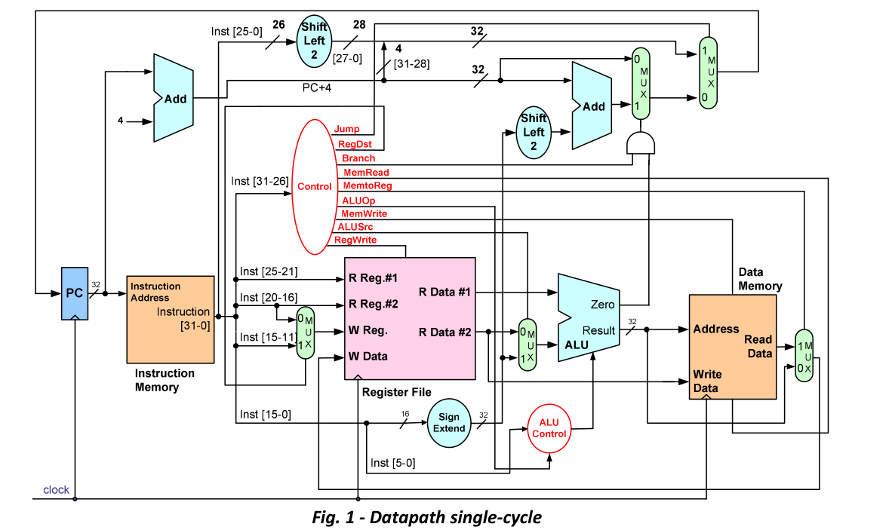
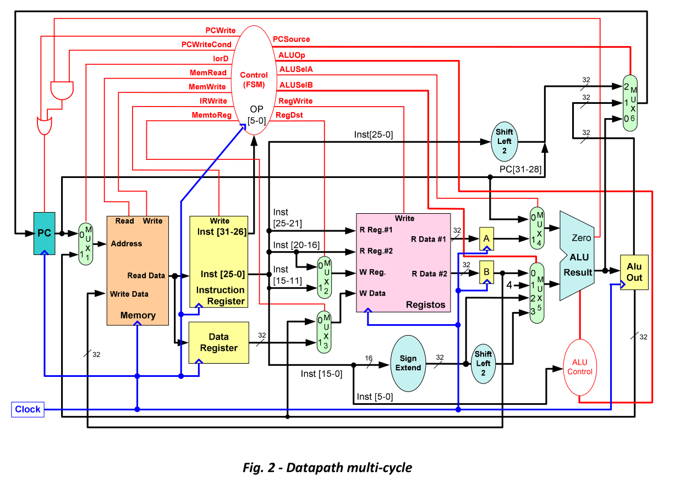

# Perguntas sobre teoria de AC-I 


## 1- Quais são os 3 blocos fundamentais de um sistema computacional?

R:	CPU, Memória, Unidades de I/O

## 2- Quais são os 3 principais blocos funcionais na arquitetura de um CPU?

R: Unidade de Controlo (coordena e controla o funcionamento da CPU), ALU (Arithmetic Logic Unity), 

## 4. Descreva de forma sucinta a função de um compilador.

R: O compilador serve para traduzir linguagens consideradas high-level para assembly language.  

## 5. Descreva de forma sucinta a função de um assembler.

R: Um assembler serve para traduzor codigo em Assembly para bits, (linguagem dos computadores).

## 6. Quantos registos internos de uso geral tem o MIPS?

R: 32.

## 7. No MIPS, qual a dimensão, em bits, que cada um dos registos internos pode armazenar?

R: 32. (4 bytes) 

## 8. Qual a sintaxe, em Assembly do MIPS, de uma instrução aritmética de soma ou subtração?

R: add, sub respetivamente

## 9. O que distingue a instrução srl da instrução sra do MIPS?

R: shift logic right e shift arithmetic right, srl (logic) ele "empurra" todos os bits à direita e acrescenta um 0 ao início, ignorando o sinal do número, sra ele tem em atenção o sinal for exemplo **101**0 srl de 1 bit ficaria 0**101**, sra de 1 bit ficaria **110**1 

## 10. Se $5=0x81354AB3, qual o resultado armazenado no registo destino, expresso em hexadecimal, das

### instruções:
### a. srl $3,$5,1    
1000 0001 0011 0101 0100 1010 1011 0011 ->  0100 0000 1001 1010 1010 0101 0101 1001= 0x409AA559 
### b. sra $4,$5,1
0xC09AA559 


## 11. System calls:

### a. O que é um system call?

R: É a solicitação de um serviço do núcleo do sistema pelo programa que está a ser executado. 

### b. No MIPS, qual o registo usado para identificar o system call a executar?

R: $v0 aka $2

### c. Qual o registo ou registos usados para passar argumentos para os systems calls?

R: $a0, $a1, $a2, $a3  $4 até $7

### d. Qual o registo usado para obter o resultado devolvido por um system call (nos casos em que isso se aplica)?

R: $v0, $2


## 12. Em Arquitetura de Computadores, como definiria o conceito de endereço?

R: Número fixo, único que identifica cada registo de memória. 

## 13. Defina o conceito de espaço de endereçamento de um processador?

R: Gama total de endereços que o CPU consegue referenciar. Exemplo caso do MIPS o espaço de endereçamento é 32 bits, 0x0000 0000 - 0xFFFF FFFF

## 14. Como se organiza internamente um processador? Quais são os blocos fundamentais da secção de dados? Para que serve a unidade de controlo?

R: Processador é organizado em secção de dados ( blocos fundamentais: multiplexers, ALU, Registos internos), Unidade de Controlo serve para coordenar os elementos do datapath, durante a execução de um programa. 
Para a execução de uma instrução o processador faz:
	
**Instruction fetch** (leitura do código maquina da instrução)

**Instruction decode** (descodificação da instrução pela unidade de controlo)

**Operand fetch** (leitura dos operandos)

**Execute** (execução da operação) 

**Store result** (armazenamento do resultado da operação no destino especificado na instrução)

## 15. Qual é o conceito fundamental por detrás do modelo de arquitetura "stored-program"?

R: "stored-program" significa que o programa é guardado na memória, por isso é capaz de executar qualquer instrução suportada.

 
## 16. Como se codifica uma instrução? Que informação fundamental deverá ter o código máquina de uma instrução?
R: A instrução codifica-se sob a forma de um número expresso em binárioA instrução codifica-se sob a forma de um número expresso em binário..
Na codificação da instrução deverá estar presente, qual a operação a executar, qual a localização dos operandos se em registos internos do CPU se na memória externa. Onde colocar os resultados. Qual a próxima instrução a executar.


## 17. Descreva pelas suas próprias palavras o conceito de ISA (Instruction Set Architecture).

R: Conjunto completo de operações que o processador pode realizar e como os programas devem ser escritos para ele. 

## 18. Independentemente do modelo da arquitetura, identifique quantas e quais as classes de instruções que compões o conjunto de instruções executáveis por um processador dessa arquitetura?

R: Processamento, Transferência de informação, Controlo de fluxo de execução. 

## 19. O que carateriza e distingue as arquiteturas do tipo "register-memory" e "load-store"? De que tipo é a arquitetura MIPS?

R: register-memory -> operandos das instruções aritméticas e lógicas residem em registos internos do CPU ou em memória
	 load-store -> ""   "" "" registos internos do CPU de uso geral mas nunca em memória. (MIPS)

## 20. O ciclo de execução de uma instrução é composto por uma sequência ordenada de operações. Quantas e quais são essas operações (passos de execução)?

R: Instruction fethc -> Instruction decode -> Operand fetch -> Execute -> Store result; 

## 21. Como se designa o barramento que permite identificar, na memória, a origem ou o destino da informação transferida?

R: Address bus 

## 22. Qual a finalidade do barramento normalmente designado por Data Bus?

R: transferência de informação exemplo: CPU <-> mem ou CPU <-> input/output

## 23. Os processadores da arquitetura hipotética ZWYZ possuem 4 registos internos e todas as instruções são codificadas usando 24 bits. Num dos formatos de codificação existem 5 campos: um OpCode com 5 bits, três campos para identificar registos internos em operações aritméticas e lógicas e um campo para codificar valores constantes imediatos em complemento para dois. Qual a gama de representação destas constantes?
	_ _ _ _ _          _ _  _ _  _ _    _ _ _ _ _ _ _ _ _ 

	_ _ _ _
R:  ^ ^ ^ ^ ^ opcode    rs   rt   rd             [-2¹², 2¹²-1]      
																										
## 24. A arquitetura hipotética ZPTZ tem um barramento de endereços de 32 bits e um barramento de dados de 16 bits. Se a memória desta arquitetura for bit_addressable:
 
### a. Qual a dimensão do espaço de endereçamento desta arquitetura? 

R: 2³² bits enderençáveis

### b. Qual a dimensão máxima da memória, expressa em bytes, suportada por esta arquitetura?

R: 2³²/8 = 2²⁹ bytes = 512MB

## 25. Considere agora uma arquitetura em que o respetivo ISA especifica uma organização de memória do tipo word-addressable, em que a dimensão da word é 32 bits. Tendo o espaço de endereçamento do processador 24 bits, qual a dimensão máxima de memória que este sistema pode acomodar se expresso em bytes?

R: 2²⁴ words * 32 bits ou 4 bytes = 2²⁶ bytes  = 64 MB 

## 26. Relativamente à arquitetura MIPS:
### a. Com quantos bits são codificadas as instruções no MIPS?

R: 32 bits

### b. O que diferencia o registo $0 dos restantes registos de uso geral?

R: $0 tem sempre o valor de zero (0x00000000) e apenas pode ser lido. 

### c. Qual o endereço do registo interno do MIPS a que corresponde a designação lógica $ra?

R: registo $31 o último registo. 

## 27. No MIPS, um dos formatos de codificação de instruções é designado por R:
### a. Quais os campos em que se divide este formato de codificação?

R: 6 campos op, rs,rt,rd, shamt, funct


### b. Qual o significado de cada um desses campos?


R: op code (6 bits) rs rt endereço dos registos que contêm 1º e 2º operandos 5 bits cada, rd registo destino onde o resultado vai ser armazenado, shamt sift amount para instruções de deslocamento (5 bits), e funct cpdigo da operação a realizar (6 bits) 

### c. Qual o valor do campo opCode nesse formato?

R: 000000 

### d. O que faz a instrução cujo código máquina é: 0x00000000?

R: op 000 000 é tipo R, rs = $0 , rt = $0, rd = $0, shamt = 0 logo fará 0 bits de possiveis shifts, funct = 0 é um sll $0, $0, 0 

## 28. O símbolo ”>>“ da linguagem C significa deslocamento à direita e é traduzido em assembly por srl ou
## sra (no caso do MIPS). Dê exemplos de casos em linguagem C em que o compilador gera um srl e
## exemplos em que gera um sra.

R: Quando é especificado se o número é signed ou unsigned, por exemplo int x = 2 se eu fizer x  = x >> 1; ele faz sra, se eu especificar que x é unsigned int ele faz srl.

## 29. Qual a instrução nativa do MIPS em que é traduzida a instrução virtual "move $4,$15"?

R: segundo os slides é or $4, $0, $15 , mas na verdade é addu $4, $0, $15.

## 30. Determine o código máquina das seguintes instruções (verifique a tabela na última página):
### a. xor $5,$13,$24  000000 01101 01100 00101 00000 100110  
### b. sub $25,$14,$8  000000 01110 00100 01101 00000 100010
### c. sll $3,$9,7     000000 00000 01001 00011 00111 000000  
### d. sra $18,$9,8    000000 00000 01001 10010 01000 000011


## 31. Traduza para instruções Assembly do MIPS a seguinte expressão aritmética, supondo que x e y são inteiros e residentes em $t2 e $t5, respetivamente (apenas pode usar instruções nativas e não deverá usar a instrução de multiplicação):
## y = -3 * x + 5;
isto é o mesmo que Y = (x - (4 * x)) + 5
```mips
	sll $t5, $t2, 1			# y = 4 * x 
	add $t5, $t2, $t5		# y = x - 4x  = - 3 x		
	addi $t5, $t5, 5		# y = -3x + 5
```
## 32. Traduza para instruções assembly do MIPS o seguinte trecho de código:
### int a, b, c;
### unsigned int x, y, z;
### z = (x >> 2) + y;
### c = (a >> 5) – 2 * b;
### //a:$t0, b:$t1, c:$t2
### //x:$a0, y:$a1, z:$a2

```mips
srl $a2, $a0, 2
add $a2, $a2, $a1 

sra $t2, $t0, 5
sll $t3, $t1, 1
sub $t2, $t2, $t $t3 
```

## 33. Considere que as variáveis g, h, i e j são conhecidas e podem ser representadas por uma variável de 32 bits num programa em C. Qual a correspondência, em linguagem C, às seguintes instruções:
```mips
#a. 
	add h, i, g		# h = i + g 

#b. 
	addi j, j, 1	# j+= 1;
	add h, h, j	#	h += j;
									
```
## 34. Assumindo que g=1, h=2, i=3 e j=4 qual o valor destas variáveis no final das sequências das alíneas da questão anterior?

R: i = 3; g = 1; j = 5; h = 9
 

## 35. Descreva a operação realizada pela instrução assembly "slt" e quais os resultados possíveis?

R: slt compara o Rsrc1 e o Rscr2 e se Rsrc1 for menor que Rsrc2 ele faz set de Rdst a 1, caso constrário seta Rdst a 0

## 36. Qual o valor armazenado no registo $1 na execução da instrução "slt $1, $3, $7", admitindo que:

### a. $3=5 e $7=23 

R: 1

### b. $3=0xFE e $7=0x913D45FC

R: 0 

## 37. Com que registo implícito comparam as instruções "bltz", "blez", "bgtz" e "bgez"?

R: $1 / $at

## 38. Decomponha em instruções nativas do MIPS as seguintes instruções virtuais:
a. blt $15, $3, exit
```mips
	slt $1, $15, $3
	bne $1, $0, exit 

```
b. ble $6,$9,exit
```mips
	slt $1, $6, $9
	beq $1, $0, exit
```
c. bgt $5,0xA3,exit

```mips
	addi $1, $0, 0xA3
	slt $1, $1, $5
	bne $1, $0, exit
```

d. bge $10,0x57,exit
e. blt $19,0x39,exit
f. ble $23,0x16,exit
## 39. Na tradução e C para assembly, quais as principais diferenças entre um ciclo "while(…){…}" e um ciclo "do{…}while(…);" ?

R: while pode não chegar a executar nenhuma vez do while executa sempre pelo menos 1 vez


## 40. Traduza para assembly do MIPS os seguintes trechos de código de linguagem C (admita que a, b e c residem nos registos $4, $7 e $13, respetivamente):
a. if(a > b && b != 0)
		c = b << 2;
	 else
		c = (a & b) ^ (a | b);

b. if(a > 3 || b <= c)
		c = c – (a + b);
	 else
		c = c + (a – 5);
## 41. Como se designa o modo de endereçamento usado pelo MIPS para ter acesso a palavras residentes na memória externa?

R: endereçamento indireto por registo

## 42. Na instrução "lw $3,0x24($5)" qual a função dos registos $3, $5 e da constante 0x24?

R: $3 é para onde vai ser colocado do valor da word lida, 0x24 é o off set, $5 é o registo onde o endereço da memória que se quer ler está, ou seja esta isntrução guarda em $3 o valor lido por $5 + 0x24 

## 43. Qual é o tipo de codificação das instruções de acesso à memória no MIPS? Descreva o seu formato e o significado de cada um dos seus campos?

R: Formato I  op 6 bits rs rt 10 bits  offset 16 bits, rt registo onde será armazenado o valor lido da memoria rs é o registo que tem o endereço para ser lido;

## 44. Qual a diferença entre as instruções "sw" e "sb"?

R: sw escreve na memória 4 bytes (1 word), sb escreve 1 byte 

## 45. O que distingue as instruções "lb" e "lbu"?

R: lb lê o byte em complemento para 2, lbu lê o byte unsigned

## 46. O que acontece quando uma instrução lw/sw tenta aceder a um endereço que não é múltiplo de 4?

R: O MIPS gera uma esceção e acaba o programa

## 47. Traduza para assembly do MIPS os seguintes trechos de código de linguagem C (atribua registos internos para o armazenamento das variáveis i e k ) :
a. int i, k;
	 for(i=5, k=0; i < 20; i++, k+=5);
b. int i=100, k=0;
	 for( ; i >= 0; )
	 {
		i--;
		k -= 2;
	 }
c. unsigned int k=0;
	 for( ; ; )
	 {
		k += 10;
	 }
d. int k=0, i=100;
	 do
		{
			k += 5;
		} while(--i >= 0);

## 48. Sabendo que o OpCode da instrução "lw" é 0x23, determine o código máquina, expresso em hexadecimal, da instrução "lw $3,0x24($5)".

R: 00100011 00101 00011  0000000000100100

## 49. Suponha que o conteúdo da memória externa foi inicializada, a partir do endereço 0x10010000, com os valores 0x01,0x02,0x03,0x04,0x05,0x06,0x07 e assim sucessivamente. Suponha ainda que $3=0x1001 e $5=0x10010000. Qual o valor armazenado no registo destino após a execução da instrução "lw $3,0x24($5)" admitindo uma organização de memória little endian?
						
R: $3 =  0x28272625  <- 0x10010024 

## 50. Considere as mesmas condições da questão anterior. Qual o valor armazenado no registo destino pelas instruções:

a. lbu $3,0xA3($5)
b. lb $4,0xA3($5)

## 51. Quantos bytes são reservados no segmento de dados da memória por cada uma das seguintes diretivas:
### a. L1: .asciiz "Aulas5&6T"    

R:10 bytes 

### b. L2: .byte 5,8,23

R: 3 bytes

### c. L3: .word 5,8,23

R: 12 bytes

### d. L4: .space 5

R: 5 bytes

## 52. Desenhe esquematicamente a memória e preencha-a com o resultado das diretivas anteriores admitindo que são interpretadas sequencialmente pelo Assembler.

a l u A     -  6 & 5 s   -   8 5(em hexa) \0 T   - \0 \0  \0 23(em hexa) - 5 -  8 - 23  - \0 \0 \0 \0 - \0 .... 

## 53. Supondo que "L1:" corresponde ao endereço inicial do segmento de dados, e que esse endereço é 0x10010000, determine os endereços a que correspondem os labels "L2:", "L3:" e "L4:".

L2: 0x1001000A
L3: 0x1001000C
L4: 0x10010018


## 54. Suponha que "b" é um array declarado como "int b[25];":

### a. Como é obtido, em C, o endereço inicial do array, i.e., o endereço a partir do qual está armazenado o seu primeiro elemento?

### b. Supondo uma memória "byte-addressable", como é obtido, em assembly o endereço do elemento "b[6]"?

R: Ao primeiro endereço de b, soma-se 6 * 4 a esse endereço 

## 55. O que é codificado no campo offset do código máquina das instruções "beq/bne" ?

R: O deslocamento que é feito a partir de program counter + 4, ou seja é a diferença entre o endereço-alvo e o program-counter, Endereço-alvo = (PC(atual) +4) + (offset << 2)

## 56. A partir do código máquina de uma instrução "beq/bne", como é formado o endereço-alvo (Branch Target Address)?

R: PC + 4 + (offset << 2) com sinal

## 57. Qual o formato de codificação de cada uma das seguintes instruções: "beq/bne", "j", "jr"?

R: Tipo J

## 58. A partir do código máquina de uma instrução "j", como se obtém o endereço-alvo (Jump Target Address)?

R: Os 26 últimos bits do código divide-se por 4, e como os endereços das instruções são múltiplos de 4 sabe-se sempre que os 2 bits menos significativos de endereço vão ser 00 e concatena-se byte mais significativo de PC+4 com o endereço-alvo 

## 59. Dada a seguinte sequência de declarações:
### int b[25];
### int a;
### int *p = b;
### Identifique qual ou quais das seguintes atribuições permitem aceder ao elemento de índice 5 do array
"b":

|a = b[5];| a = *p + 5;|a = *(p + 5);|a = *(p + 20);|
|--|--|--|--|
|x||x(em C) | x (em assembly)|


## 60. Assuma que as variáveis f, g, h, i e j correspondem aos registos $t0, $t1, $t2, $t3 e $t4 respetivamente. Considere que o endereço base dos arrays de inteiros A e B está contido nos registos $s0 e $s1. Considere ainda as seguintes expressões:
### f = g + h + B[2]
### j = g - A[B[2]]

### a. Qual a tradução para assembly de cada uma das instruções C indicadas?

R: ```mips
		# f = g + h + B[2]
		add $t0, $t1, $t2
		addiu $t5, $s1, 4
		lw $t5, 0($t5)
		add $t0, $t0, $t5

		# j = g - A[B[2]]
		#sendo $t5 lw $t5, 0($t5) de cima
		
		add $t5, $s0, $t5
		lw $t5, 0($t5)
		sub $t4, $t1, $t5
		
``` 

### b. Quantas instruções assembly são necessárias para cada uma das instruções C indicadas? E quantos registos auxiliares são necessários?


R:	1 registo auxiliar

### c. Considerando a tabela seguinte que representa o conteúdo byte-a-byte da memória, nos endereços correspondentes aos arrays A e B, indique o valor de cada elemento dos arrays assumindo uma organização little endian.


Tabela A | Endereço | Valor | | :--- | :--- | | A+12 | ... | | A+11 | 0x00 | | A+10 | 0x00 | | A+9 | 0x00 | | A+8 | 0x01 | | A+7 | 0x22 | | A+6 | 0xED | | A+5 | 0x34 | | A+4 | 0x00 | | A+3 | 0x00 | | A+2 | 0x00 | | A+1 | 0x00 | | A+0 | 0x12 |

Tabela B | Endereço | Valor | | :--- | :--- | | B+12 | ... | | B+11 | 0x00 | | B+10 | 0x00 | | B+9 | 0x00 | | B+8 | 0x02 | | B+7 | 0x00 | | B+6 | 0x00 | | B+5 | 0x50 | | B+4 | 0x02 | | B+3 | 0xFF | | B+2 | 0xFF | | B+1 | 0xFF | | B+0 | 0xFE |

R: A[0] = 0x12 A[1] = 0x00 A[2] = 0x00 B[0] = 0xFE B[1] = 0xFF B[2] = 0xFF

## 61. Pretende-se escrever uma função para a troca do conteúdo de duas variáveis (a e b). Isto é, se, antes da chamada à função, a=2 e b=5, então, após a chamada à função, os valores de a e b devem ser: a=5 e b=2
Uma solução incorreta para o problema é a seguinte:
```c
void troca(int x, int y)
{
	int aux;
	aux = x;
	x = y;
	y = aux;
}

```
## Identifique o erro presente no trecho de código e faça as necessárias correções para que a função tenha o comportamento pretendido.

R: Foram passados como argumentos por valor, ou seja a função só altera os valores das variáveis dentro da função, fora dela x continua com valor de x e y com y.

## 62. Na instrução "jr $ra", como é obtido o endereço-alvo?

R: jump on register codifica o número do registo que possui o valor de 32 bits do endereço-alvo

## 63. Qual é o menor e o maior endereço para onde uma instrução "j", residente no endereço de memória 0x5A18F34C, pode saltar?

R: menor é 0x50000000  0x5FFFFFFC

## 64. Qual é o menor e o maior endereço para onde uma instrução "beq", residente no endereço de memória 0x5A18F34C, pode saltar?

R: 16 bits de offset 2¹⁶ = 32k  =0x20000,  0x5A18F34C - 0x20000 = 0x5A16F34C 
mínimo : 0x5A16F34C 
máximo : 0x5A1AF34C   

## 65. Qual é o menor e o maior endereço para onde uma instrução "jr", residente no endereço de memória 0x5A18F34C pode saltar?

R: min:0x00000000, max:0FFFFFFFC 

## 66. Qual a gama de representação da constante nas instruções aritméticas imediatas (e.g. addi)? 

R: 4 bytes, 16 bits, em complemento p 2 logo [-32768, +32767]

## 67. Qual a gama de representação da constante nas instruções lógicas imediatas (e.g. andi)? 

R: 16 bits sem compl p 2 [0, 65535]

## 68. Por que razão não existe, no ISA do MIPS, uma instrução nativa que permita manipular diretamente uma constante de 32 bits?

R: A codificação das instruções são de tamanho fixo de 32 bits, por exemplo addi é necessário estar na codigficação o registo destino e o registo rs a operar sobram 32 - 10 = 22 bits, o op code das instruções é 6 bits, por isso sobram 16 bits para o immediate.

## 69. Como é que, no assembly do MIPS, se podem manipular constantes de 32 bits?

R: a instrução lui, "carrega" o registo a operar com uma constante nos 4 bytes mais significativos, depois de carregados, basta carregar os 4 bytes menos significativos com um ori por exemplo.
 
## 70. Apresente a decomposição em instruções nativas das seguintes instruções virtuais:
### a. li $6,0x8B47BE0F

```mips
	lui $6, 0x8B47
	ori $6, $6, 0xBE0F
	
```

### b. xori $3,$4,0x12345678
```mips 
	lui $1, 0x1234
	ori $1, $1, 0x5678
	xor $3, $4, $1
```

### c. addi $5,$2,0xF345AB17

mesma logica que xori 

### d. beq $7,100,L1

```mips
	addi $1, $1, 100
	beq $7, $1, L1
```

### e. blt $3, 0x123456, L2


## 71. O que é uma sub-rotina?

R: Funções 

## 72. Qual a instrução do MIPS usada para evocar uma sub-rotina?

R: jal

## 73. Por que razão não pode ser usada a instrução "j" para evocar uma sub-rotina?

R: jal armazena o valor atual do PC no $ra

## 74. Quais as operações que são sequencialmente realizadas na execução de uma instrução de evocação de uma sub-rotina?

R: fetch, ( $ra armazena o endereço de retorno PC+4 ), execute, $ra = PC (PC + 4 ) (PC = target_address)  

## 75. Qual o número e nome virtual do registo associado à execução dessa instrução?

R: $ra ou $31 

## 76. No caso de uma sub-rotina ser simultaneamente chamada e chamadora (sub-rotina intermédia) que operações é obrigatório realizar nessa sub-rotina?

R: Salvaguardar o registo $ra

## 77. Qual a instrução usada para retornar de uma sub-rotina?

R: jr $ra

## 78. Que operação fundamental é realizada na execução dessa instrução?

R: O valor guardado no $ra é devolvido ao PC 

## 79. O que é uma stack e qual a finalidade do stack pointer?

R: Uma stack é uma estrutura de dados, que serve para guardar o valor de registos ao qual uma sub-rotina possa alterar e que ao acabar a sub-rotina possamos devolver o valo que esse registo entrou na sub-rotina. 


## 80. Como funcionam as operações de push e pop?

R: Push: é necessária uma atualização o stack-pointer e serve para "escrever" na memória o valor do registo em ordem LIFO, Pop: é feita a leitura e devolução do endereço e após isso é feita a atualização do valor do stack-pointer

## 81. Por que razão as stacks crescem normalmente no sentido dos endereços mais baixos?

R: Gestão simplificada da fronteira entre os segmentos de dados e de stack.

## 82. Quais as regras para a implementação em software de uma stack no MIPS?

R: O registo $sp ($29) contém o último endereço da última posição ocupada da stack; a stack cresce no sentido decrescente, A stack está organizada em words de 32 bits


## 83. Qual o registo usado, no MIPS, como stack pointer?

R: $29 ($sp)

## 84. De acordo com a convenção de utilização de registos no MIPS:

### a. Que registos são usados para passar parâmetros e para devolver resultados de uma sub-rotina?

R: $an e $vn

### b. Quais os registos que uma sub-rotina pode livremente usar e alterar sem necessidade de prévia salvaguarda?

R: $tn

### c. Quais os registos que uma sub-rotina chamadora tem a garantia que a sub-rotina chamad não altera?

R: $sn

### d. Em que situação devem ser usados registos “$sn”?

R: Quando numa sub-rotina é chamada outra sub-rotina e é necessário salva-guardar os registos usados como argumentos/parâmetros dessas sub-rotinas.

### e. Em que situação devem ser usados os restantes registos: $tn, $an e $vn?

R: $tn qualquer situação, $an para serem passados como argumentos de funções, $vn para devolver, todos podem ser usados em qualquer situação mas cada um é agrupado com estas funções

## 85. De acordo com a convenção de utilização de registos do MIPS:

### a. Que registos podem ter de ser copiados para a stack numa sub-rotina intermédia?

R: nenhum

### b. Que registos podem ter de ser copiados para a stack numa sub-rotina terminal?

R: $ra, e se necessário $sn

## 86. Para a função com o protótipo seguinte indique, para cada um dos parâmetros de entrada e para o valor devolvido, qual o registo do MIPS usado para a passagem dos respetivos valores: ```c char fun(int a, unsigned char b, char *c, int *d);```

R: $v0 valor devolvido, argumentos: a : $a0, b : $a1, c : $a2, d : $a3 

## 87. Para uma codificação em complemento para 2, apresente a gama de representação que é possível obter com 3, 4, 5, 8 e 16 bits (indique os valores-limite da representação em binário, hexadecimal e em decimal com sinal e módulo).


R: 3 bits [100, 011] , [-8, 7] , [0x4, 0x3]
	mm coisa p 4,5,8,16 [-2¹⁶, 2¹⁶-1]

## 88. Traduza para assembly do MIPS a seguinte função “fun1()”, aplicando a convenção de passagem de parâmetros e salvaguarda de registos:
```c 
char *fun2(char *, char);
char *fun1(int n, char *a1, char *a2)
{
	int j = 0;
	char *p = a1;

	do
	{
		if((j % 2) == 0)
			fun2(a1++, *a2++);
	} while(++j < n);
	*a1='\0';
	return p;
}
```

## 89. Determine a representação em complemento para 2, com 16 bits, das seguintes quantidades decimais:


	5,-3,-128,-32768, 31,-8,256,-32
## 90. Determine o valor em decimal representado por cada uma das quantidades seguintes, supondo que estão codificadas em complemento para 2 com 8 bits:


		0b00101011,0xA5,0b10101101,0x6B,0xFA,0x80

## 91. Determine a representação das quantidades do exercício anterior em hexadecimal com 16 bits (também codificadas em complemento para 2).


## 92. Como é realizada a deteção de overflow em operações de adição com quantidades sem sinal? 

R:  O bit de carry da ALU é igual a 1 

## 93. Como é realizada a deteção de overflow em operações de adição com quantidades com sinal (codificadas em complemento para 2)?

R: Quando o carry in do bit mais significativo não é igual ao carry-out C_(n-1) ^  C_n = 1

## 94. Considere os seguintes pares de valores em $s0 e $s1:
### i. $s0 = 0x70000000 $s1 = 0x0FFFFFFF
### ii. $s0 = 0x40000000 $s1 = 0x40000000

### a. Qual o resultado produzido pela instrução add $t0, $s0, $s1?

R: i: 0x70000000 + 0x0FFFFFFF = 0x7FFFFFFF
	ii: 0x80000000

### b. Para a alínea anterior os resultados são os esperados ou ocorreu overflow?

R: 7+0 = 7 carry 0 carry out = 0 sem overflow
   4+4 = 8 carry 0 carry out = 0 sem overflow 

### c. Qual o resultado produzido pela instrução sub $t0, $s0, $s1?

R: i: 0x70000000 + (- 0x0FFFFFFF)  = 0x70000000 + 0xF0000001 = 0x6000001
	ii:	0x40000000 - 0x40000000 = 0x0 

### d. Para a alínea anterior os resultados são os esperados ou ocorreu overflow?

R: caso i: 7 + f = 6 carry 1 -> carry out = 1 carry in = carry out não há overflow

### e. Qual o resultado produzido pelas instruções:

add $t0, $s0,$s1
add $t0, $t0,$s1

... verificar o carry in e o carry out


### f. Para a alínea anterior os resultados são os esperados ou ocorreu overflow?
## 95. Para a multiplicação de dois operandos de "m" e "n" bits, respetivamente, qual o número de bits necessário para o armazenamento do resultado qualquer que este seja?

R: m + n bits


## 96. Apresente a decomposição em instruções nativas das seguintes instruções virtuais:

### a. mul $5,$6,$7

R: ```mips
	mul $6, $7
	mflo $5
```

### b. la $t0,label c/ label = 0x00400058

R: 
```mips
	lui $t0, 0x0040
	ori $t0, $t0, 0x0058
```

### c. div $2,$1,$2

R: 
```mips
	div $1, $2
	mflo $t2
```
### d. rem $5,$6,$7

R: 
```mips
	div $6, $7
	mfhi $5
```
### e. ble $8,0x16,target
R: 
```mips
	addiu $1, $1, 0x16
	slt $1, $1, $8
	beq $1, $0, target  


```
### f. bgt $4,0x3F,target
$4 > 0x3F
R: 
```mips
	addiu $1, $1, 0x3F
	slt $1, $1, $4
	bne $1, $0, target

```
## 97. Determine o resultado da instrução mul $5,$6,$7, quando


$6=0xFFFFFFFE e $7=0x00000005.

R: 0000000   0010   -2 * 5  = -10  - 0x0000000 1010 =   0xFFFFFFF6

## 98. Determine o resultado da execução das instruções virtuais div $5,$6,$7 e rem $5,$6,$7 quando $6=0xFFFFFFF0 e $7=0x00000003
	$6 = -16 
	$7 = 3
	16 / 3 = 5 * 3 + 1
R: div : -5 rem : -1


## 99. Admita que pretendemos executar, em Assembly do MIPS, as operações: $t0 = $t2/$t3 e $t1 = $t2 % $t3.
Escreva a sequência de instruções em Assembly que permitem realizar estas duas operações. Use
apenas instruções nativas


```mips 
	div $t2, $t3
	mflo $t0
	mfhi $t1
```


## 100. Descreva as regras que são usadas, na ALU do MIPS, para realizar uma divisão inteira entre duas quantidades com sinal.

R: Divide-se dividendo por divisor, em módulo, O quociente tem sinal negativo se  os sinais do dividendo e do divisor forem diferentes, o resto tem o mesmo sinal do dividendo
## 101. Considerando que $t0=-7 e $t1=2, determine o resultado da instrução div $t0,$t1 e o valor armazenado respetivamente nos registos HI e LO.

R: -7 / 2 = -3 resto -1
LO: -3 
HI: -1

## 102. Repita o exercício anterior admitindo agora que $t0=0xFFFFFFF9 e $t1=0x00000002.

R: $t0 :   -7
	 $t1 : 0x00000002 = 2 

-10 / 2 = -5 resto 0 

HI: -1 = 0xFFFFFFFF
LO: -3 = 0x0000000 1101= 0xFFFFFFFD

## 103. Considerando que $5=-9 e $10=2, determine o valor que ficará armazenado no registo destino pela instrução virtual rem $6,$5,$10.


## 104. As duas sub-rotinas seguintes permitem detetar overflow nas operações de adição com e sem sinal, no MIPS. Analise o código apresentado e determine o resultado produzido, pelas duas sub-rotinas, nas seguintes situações:
```mips
a. $a0=0x7FFFFFF1, $a1=0x0000000E;
b. $a0=0x7FFFFFF1, $a1=0x0000000F;
c. $a0=0xFFFFFFF1, $a1=0xFFFFFFFF;
d. $a0=0x80000000, $a1=0x80000000;
# Overflow detection, signed
# int isovf_signed(int a, int b);
		isovf_signed: or $v0,$0,$0 # $v0 = 0
		xor $1,$a0,$a1		# $1 = $a0 ^ $a1 ( bit  != bit = 1 
		slt $1,$1,$0			# $1 = 1 if $1 < 0 else $1 = 0 se o seu primeiro bit for 1 temos de ver se o carry out 
		bne $1,$0,notovf_s # $1 >= 0 não há overflow
		addu $1,$a0,$a1		# $1 = a0 + a1
		xor $1,$1,$a0		 # $1 = (a0 + a1) ^a0
		slt $1,$1,$0		 # se $1 < 0 não há overflow
		beq $1,$0,notovf_s	# $1 >= 0 há 
		ori $v0,$0,1
		notovf_s: jr $ra
# Overflow detection, unsigned
# int isovf_unsigned(unsigned int a, unsigned int b);
isovf_unsig: ori $v0,$0,0
					nor $1,$a1,$0
					sltu $1,$1,$a0
					beq $1,$0,notovf_u
					ori $v0,$0,1
motovf_u:	jr $ra
```


## 105. As duas sub-rotinas anteriores podem ser também escritas alternativamente com o código abaixo. A abordagem é ligeiramente diferente. No caso de operações sem sinal, o overflow pode ser detetado para as operações de soma e subtração. Analise o código apresentado e determine o resultado produzido, pelas duas sub-rotinas, nas condições indicadas nas alíneas da questão anterior:

```mips

# Overflow detection in addition, unsigned
# int isovf_unsigned_plus(unsigned int a, unsigned int b);
		isovf_unsig_plus:
		ori $v0, $0, 0
		addu $t2, $a0, $a1
# temp = A + B;
		bge $t2, $a0, notovf_uadd
		bge $t2, $a1, notovf_uadd
ori $v0, $0, 1
notovf_uadd: jr
$ra
# Overflow detection in subtraction, unsigned
# int isovf_unsigned_sub(unsigned int a, unsigned int b);
isovf_unsig_sub:
ori $v0,$0,0
slt $1, $a0, $a1
beq $1, $0, notovf_usub
ori $v0, $0,1
notovf_usub: jr
$ra
# Overflow detection, signed
# int isovf_signed(int a, int b);
isovf_signed:
ori $v0,$0,0
add $1, $a0, $a1
xor $a1, $a0, $a1
bltz $a1, notovf_s
xor $a1, $1, $a0
bgez $a1, notovf_s
ori $v0,$0,1
notovf_s:
jr
$ra
# res = a + b;
# tmp = a ^ b;
# if (tmp < 0) no_ovf();
# tmp = res ^ a;
# if (tmp >= 0) no_ovf();  
```


## 106. Ainda no código das sub-rotinas das questões anteriores, qual a razão para não haver salvaguarda de qualquer registo na stack?

R: Pois se tratar de uma sub-rotina terminal, ou seja é uma sub-rotina que não chama outras sub-rotinas.

## 107. Na conversão de uma quantidade codificada em formato IEEE 754, precisão simples, para decimal, qual o número máximo de casas decimais com que o resultado deve ser apresentado?

R: floor( 23 log 2/log 10 ) = 6 

## 108. Responda à questão anterior admitindo que o valor original se encontra agora representado com precisão dupla no formato IEEE 754.

R: floor (52 / log2 10) = 15;

## 109. Determine a representação em formato IEEE 754, precisão simples, da quantidade real 19,1875. Determine a representação da mesma quantidade em precisão dupla.

R: parte inteira 19 : 10011
	parte fracionária 0,1875 -> *2 = 0, 3750  * 2 =  0,7500 * 2 =  1, 5000 =  1, 0000 -> .0011
10011.0011 * 2⁰ = 1.00110011 * 2⁴
	sinal 0, expoente codificado 4 + 127 = 131 = 10000010
	0 10000010 00110011000000000000000
	
R: precisão dupla 

	parte inteira 10011
	parte fracionária: 0011
	sinal 0, expoente 1023 + 4 = 1027 = 10000000011
0 10000000011 0011001100000000000000000000000000000000000000000000


## 110. Determine, em decimal (vírgula fixa), o valor das quantidades seguintes representadas em formato IEEE 754, precisão simples. Na alínea b) apresente apenas o valor em notação científica usando base 2.

### a. 0xC19A8000.
1100 0001 1001 1010 1000 0000 0000 0000 
1 10000011 00110101 
(-) 128 + 2 + 1  = 127 + 4, 

(-) 1.00110101 * 2⁴ = 10011.0101 = 1+ 2+16 + 2⁻²+ 2⁻⁴ = -19,3125

### b. 0x80580000.
mesma coisa


## 111. Considere que o conteúdo dos dois registos seguintes da FPU representam a codificação de duas quantidades reais no formato IEEE 754 precisão simples:
### $f0 = 0x416A0000
### $f2 = 0xC0C00000

### Calcule o resultado das instruções seguintes, apresentando o seu resultado em hexadecimal: 

a. abs.s$f4,$f2# $f4 = abs($f2)

f0 -> 0x416A0000

f2 -> 0x40C00000 

b. neg.s$f6,$f0# $f6 = neg($f0)

f0 -> 0xC16A0000

f2 -> 0x40C00000

c. sub.s$f8, $f0,$f2# $f8 = $f0 – $f2

f0 -> 0x416A0000 -> 0100 0001 0110 1010 0000 0000 0000 0000 
										0 1000 0010 01101010
										130 -127 = 3 EXPOENTE

f2 -> 1 100 0000 1 100 0000 0000 
			1 1000 0001 1000000..
			129 - 127 = 2 
f0 -> 1.01101010 * 2³ 
f1 -> -0.11 * 2³

1.01101010 * 2³ + 0.11 * 2³ =    1,01001010 * 2⁴ 
127 + 4 = 131 = 128 + 2 Exp codif
0 100 0001 1 010 0101 00000000....
0x41A50000
d. sub.s$f10,$f2,$f0# $f10 = $f2 - $f0

e. add.s$f12,$f0,$f2# $f12 = $f0 + $f2

f. mul.s$f14,$f0,$f2# $f14 = $f0 * $f2

g. div.s$f16,$f0,$f2# $f16 = $f0 / $f2

h. div.s$f18,$f2,$f0# $f18 = $f2 / $f0

i. cvt.d.s $f20,$f2# Convert single to double


j. cvt.w.s $f22,$f0# Convert single to integer


## 112. Considere a sequência de duas instruções Assembly:
 ### lui $t0,0xC0A8
 ### mtc1 $t0,$f8
## qual o valor que ficará armazenado no registo $f8, expresso em base dez e vírgula fixa, admitindo uma interpretação em IEEE 754 precisão simples?

R: 0xC0A80000

1100 0000 1010 1011 0000 0000 0000 0000 
1 1000 0001  0101101100000000 00000000
(-) 1000 00001 = 129 = 129 = exp + 127 = exp = 129 - 127 = 2 

1.01011011 * 2² = 4+1+0,25+0,125+0,03125+0,015625 = 5,421875

## 113. Considerando que $f2=0x3A600000 e $f4=0xBA600000, determine o resultado armazenado em $f0 pela instrução sub.s $f0,$f2,$f4.

R: 0 011 1010 0 110 0000 0000 0000 0000 0000
1 011 1010 0 110 0000 0000 0000 0000 0000 

sinal + -(-) 
01110100,  4 + 16 + 32 + 64 = 116 
expoente codificado 116,  expoente = 116 - 127 = -11 
fica 
(+)1.11 *2⁻¹¹ - (-)1.11 *2⁻¹¹ =          11.10 * 2⁻¹¹ = 1.110 * 2 ⁻¹⁰
127 - 10 = 117 
0 (0111 0101)   11000000000000000000000
1 bit sinal 8 expoente codificado e 23 bits parte fracionaria 

 0011 1010 1110 000000000000000000000
0x3AE000000000

## 114. Repita o exercício anterior admitindo agora as seguintes condições:
### $f4=0x3F100000 e $f6=0x408C0000 e a instrução add.s $f8,$f4,$f6.
### $f2=0x3F900000 e $f4=0xBEA00000 e a instrução mul.s $f0,$f2,$f4
### $f2=0x258c0000 e $f4=0x41600000 e a instrução div.s $f0,$f2,$f4


## 115. Numa norma hipotética KPT de codificação em vírgula flutuante, a mantissa normalizada após a realização de uma operação aritmética tem o valor 1.1111 1111 1111 1110 1000 0000. Qual será o valor final da mantissa (com 16 bits na parte fracionária) após arredondamento para o ímpar mais próximo?

R: 1.1111 1111 1111 1111 


## 116. Assuma que x é uma variável do tipo float residente em $f8 e que o label endWhile corresponde ao endereço da primeira instrução imediatamente após um ciclo while(). Se a avaliação da condição para executar o loop for while (x > 1.5){..} escreva, em Assembly do MIPS, a sequência de instruções necessárias para determinar esta condição.

```mips

	l.s $f2, 0(endereço 1.5)

	c.lt.s $f2, $f8
	bc1f endWhile 
```


## 117. Determine, de acordo com o formato IEEE 754 precisão simples, a representação normalizada, e arredondada para o par mais próximo, do número 100,110110000000000000101102.


R: 1,00110110000000000000110 * 2²     
127 + 2 = 129 
 0 100 0000 1001 1011 0000 0000 0000 0110

## 118. Descreva as diferenças entre uma arquitetura Harvard e uma arquitetura von Neumann?

R: 
	von Neumann: um único de endereçamento para instruções e dados; acesso a instruções e dados é feito em ciclos de relógios destintos
	Harvard: dois espaços de endereçamento separados: um para dados e outro para instruções; possibilidade de acesso, no mesmo ciclo de relógio, a dados e instruções; memórias de dados e instruções podem ter dimensões de palavra diferentes;  


## 119. Suponha um sistema baseado numa arquitetura von Neumann, com um barramento de endereços de 20 bits e com uma organização de memória do tipo byte-addressable. Qual a dimensão máxima, em bytes, que os programas a executar neste sistema (instruções+dados+stack) podem ter?

R: 2²⁰

## 120. Num processador baseado numa arquitetura Harvard, a memória de instruções está organizada em words de 32 bits, a memória de dados em words de 8 bits (byte-addressable) e os barramentos de endereços respetivos têm uma dimensão de 24 bits. Qual a dimensão, em bytes, dos espaços de endereçamento de instruções e de dados?

R: instruções : 32 bits   = 4 bytes -> 2² * 2²⁴
		dados : 8 bits  = 1 byte -> 2²⁴

## 121. Descreva o significado funcional da afirmação “todos os elementos de estado têm escrita síncrona”.

R: Significa que a atualização do valor guardado (escrita) não ocorre imediatamente após a alteração dos dados de entrada. Em vez disso, a escrita é coordenada por um sinal de controlo externo, ocorrendo apenas num instante preciso: a transição ativa (flanco) do sinal de clock. 

## 122. Considere um elemento de estado, com leitura assíncrona, que apenas tem o sinal de clock, na sua interface de controlo. O que pode concluir-se relativamente ao processo de escrita neste elemento?

R:  Pode concluir-se que a escrita é incondicional. Como o elemento não possui um sinal de permissão de escrita, ele irá capturar e armazenar o valor presente na sua entrada em todos os ciclos de clock, sem exceção.

## 123. Suponha um elemento de estado, com escrita síncrona e leitura assíncrona, que apresenta, na sua interface de controlo, um sinal "read", um sinal "write" e um sinal de clock. Indique que sinal ou sinais têm de estar ativos para que se realize:

a. uma operação de leitura; 

R: o sinal de read  ativo 

b. uma operação de escrita.

R: o sinal de write ativo na transição ativa do clock 


## 124. Qual a capacidade de armazenamento, expressa em bytes, de uma memória com uma organização interna em words de 32 bits e um barramento de endereços de 30 bits?

R: 2³⁰ * 4 = 2³²

## 125. Quais as operações realizadas num datapath single cycle que são comuns a todas as instruções?

R: Usar o conteúdo do registo Program Counter como endereço da memória do qual vai ser lido o código máquina da próxima instrução e efetuar essa leitura; Ler o conteúdo dos registos internos rs rt 

## 126. Considere ainda um datapath single cycle. Identifique a operação realizada na ALU durante a execução de cada uma das seguintes instruções: tipo R, addi, slti, lw, sw e beq.


R: A ALU executa a operação especificada no campo funct da codificação das instruções tipo R

## 127. No mesmo datapath, indique qual a operação realizada na conclusão de cada uma das seguintes instruções: tipo R, addi, slti, lw, sw e beq e j.

R: Escrita do resultado no registo destino rd 

## 128. Suponha que a instrução add $3,$4,$5 está a ser executada num datapath single cycle. Identifique todas as operações que serão realizadas na próxima transição ativa do sinal de relógio.

R: atualização do PC ( do cálculo PC + 4 ) e escrita do resultado no registo de destino 

## 129. No datapath single-cycle que tipo de informação é armazenada na memória cujo endereço é a saída do registo PC?


R: o código da instrução a executar 

## 130. Suponha que num datapath single cycle cada registo do banco de registos foi inicializado com um valor igual a: (32 – endereço do registo). Indique o valor presente nas entradas do banco de registos ReadReg1, ReadReg2 e WriteReg, e o valor presente nas saídas ReadData1 e ReadData2, durante a execução das instruções com o código máquina:

a. 0x00CA9820

000000 00110 01010 10011 00000 100000

tipo R 
opcode 000000
rs 00110 $6  ReadReg1
rt 01010 $10 ReadReg2
rd 10011 $19 WriteReg
shamt 00000
funct 100000 add 
ReadData1 32-6
ReadData2 32-10 


b. 0x8D260018 (lw)

1000 1101 0010 0110 0000 0000 0001 1000

opcode 6

rs 01001  ReadReg1

rt 00110	WriteReg								

offset 32 -6 - 10 = 16  

ReadData1 32 - 9 = 23 


c. 0xAC6A003C (sw)

1010 1100 0110 1010 0000 0000 0011 1100 

op code: 101011

rs 00011  ReadReg1 

rt 01010  ReadReg2

offset 0000 0000 0011 1100 

ReadData1 from rs 

ReadData2 from rt 


## 131. Considerando ainda a inicialização do banco de registos da questão anterior, indique qual o valor calculado pela ALU durante a execução das instruções LW com o código máquina 0x8CA40005 e 0x8CE6FFF3.

R: 0x8CA40005 = 1000 1100 1010 0100 0000 0000 0000 0101
	opcode 100011 
	rs 00101  $5     0x5($5)
	rt 00100  $4     $4, 0x5($5) 
	offset 0000 0000 0000 0101
	32-5 = 27 
 valor calculado pela ALU	27 + 5 = 32 
  	
	0x8CE6FFF3 = 1000 1100 1110 0110 1111 1111 1111 0011
	op 100011
	rs 00111
	rt 00110
	offset 1111 1111 1111 0011 = -13  
	
Na alu	32 - 7 - 13 = 12 

## 132. Qual o valor à saída do somador de cálculo do BTA durante a execução da instrução cujo código máquina é 0x10430023, supondo que o valor à saída do registo PC é 0x00400034?

R: 0x10430023 = 0001 0000 0100 0011 0000 0000 0010 0011 
	 000100 00010 00011 offset 0000 0000 0010 0011  off set = 35 * 4 = 140
	 
	0x00400034 + 4 + offset << 2 = 0x00400038 + 0000 000 1000 1100 = 0x00400038 + 0x8C = 0x004000C8

## 133. Numa implementação single cycle da arquitetura MIPS, a frequência máxima de operação é de 2GHz (para os atrasos de propagação a seguir indicados). Determine o atraso máximo que pode ocorrer nas operações da ALU. Considere que, para o File Register e para as memórias, os tempos de escrita indicados são os tempos de preparação da operação antes de uma transição ativa do sinal de relógio. Memórias externas: leitura – 175ps, escrita – 120ps; File register: leitura – 45ps, escrita – 15ps; Unidade de Controlo: 10ps; Somadores: 40ps; Outros: 0ns; Setup time do Program Counter: 5ps

2 GHz = 1 / 2GHz = 500 ps
	t_atraso + T_exec <= 500ps
	t_exec = 175 + 120 + 45 + 15 + 10 + 40 + 5 = 250 
	R: t_atraso <= 250
	 

## 134. Determine, numa implementação single-cycle da arquitetura MIPS, a frequência máxima de operação imposta pela instrução “sw”, assumindo os atrasos a seguir indicados: 

### Memórias externas: leitura – 12ns, escrita – 4ns; File register: leitura – 4ns, escrita – 1ns; Unidade de Controlo: 1ns; ALU (qualquer operação): 5ns; Somadores: 2ns; Outros: 0ns. Setup time do Program Counter: 1ns

R: 12 + 4 + 4+ 1 + 1+ 5 + 2 +1 =29 ns 
	1/29 = 34 MHz

## 135. Determine, numa implementação single-cycle da arquitetura MIPS, a frequência máxima de operação imposta pela instrução "beq", assumindo os atrasos a seguir indicados:
### Memórias externas: leitura – 11ns, escrita – 3ns; File register: leitura – 3ns, escrita – 1ns; Unidade de Controlo: 1ns; ALU (qualquer operação): 5ns; Somadores: 2ns; Outros: 0ns. Setup time do Program Counter: 1ns

R: sum e 1/sum


## 136. Determine, numa implementação single cycle da arquitetura MIPS, o período mínimo do sinal de relógio imposto pelas instruções tipo R, assumindo os atrasos a seguir indicados:
### Memórias externas: leitura – 12ns, escrita – 4ns; File register: leitura – 3ns, escrita – 1ns; Unidade de Controlo: 1ns; ALU (qualquer operação): 6ns; Somadores: 2ns; Outros: 0ns. Setup time do Program Counter: 1ns

R: sum todos os tempos 


## 137. Identifique os principais aspetos que caracterizem uma arquitetura single cycle, quer do ponto de vista do modelo da arquitetura, como das características da sua unidade de controlo.

R: Todas as etapas (busca de instrução, decodificação, leitura de registradores, execução da ALU, acesso à memória, escrita de registradores) são completadas em um único ciclo. A duração de um ciclo de clock deve ser suficiente para a instrução mais "lenta"; Sobre a unidade de controlo os sinais da instrução permanecem ligados durante o ciclo todo; 


## 138. Numa implementação single cycle da arquitetura MIPS, no decurso da execução de uma qualquer instrução, a que corresponde o valor presente na saída do registo PC? 

R: endereço da instrução atual a executar


## 139. No datapath single-cycle a frequência do relógio é limitada. Descreva o que determina qual a frequência máxima a que um datapath deste tipo pode funcionar.

R: A operação mais lenta que o datapath possa realizar 

## 140. Preencha a tabela seguinte, para as instruções indicadas, com os valores presentes à saída da unidade de controlo principal da arquitetura single cycle dada nas aulas.

| Instrução | Opcode | ALUOp[1..0] | Branch | RegDst | ALUSrc | MemtoReg | RegWrite | MemRead | MemWrite |
| :--- | :--- | :---: | :---: | :---: | :---: | :---: | :---: | :---: | :---: |
| **Lw** | 100011 | 00 | 0 | 0 | 1 | 1 | 1 | 1 | 0 |
| **Sw** | 101011 | 00 | 0 | x | 1 | x | 0 | 0 | 1 |
| **addi** | 001000 | 10 | 0 | 0 | 1 | 0 | 1 | 0 | 0 |
| **slti** | 001010 | 10 | 0 | 0 | 1 | 0 | 0 | 1 | 0 |
| **beq** | 000100 | 01 | 1 | x | 0 | 0 | x | 0 | 0 |
| **R - Format** | 00000 | 10 | 0 | 1 | 0 | 0 | 0 | 1 | 0 |


## 141. Admita que na versão single cycle do CPU MIPS dado nas aulas, pretendíamos acrescentar o suporte das instruções jal address e jr $reg. Esquematize as alterações que teria de introduzir no datapath para permitir a execução destas instruções (use como base o esquema da próxima página).



R: jal address, ou seja para isso acontecer teria que acontecer um Jump, MemtoReg, RegDest para escolher $ra e salvaguardar PC + 4 em $ra ou seja nessa mux adicionar uma opção para $ra, depois  o MemtoReg vai ter uma adição extra como entrada de escolher usar PC + 4 para escrever no $ra que o mux RegDest escolheu, finalmente Jump = 1 para ser feito o saltoincondicional ao endereço e atualizar PC; 

jr $ra, lê o valor de $ra, e faz o salto, o Jump tem uma nova entrada que é a saída R data 1, para que a memoria PC seja atualizada;  

## 142. Admita que na versão single cycle do CPU MIPS, pretendíamos executar a instrução slt $3,$5,$9. Descreva por palavras suas como é esta instrução realizada ao nível da ALU, e qual o conteúdo final no registo $3, admitindo que $5=0xFF120008 e $9=0x00C00FFF.

R: slt é uma instrução tipo R opcode 000000 00101 01001 00011 00000 101010
	 também	é lida aquilo que está no rt, e escrito no rd $3 0 ou 1 se valor guradado em $5 < valor guardado em $9, $5 - $9 se resultado < 0 set $3 ->1   else set $3 ->0
		
		0xFF120008 - 0x00C00FFF	
		1111 1111 0001 0010 0000 0000 0000 1000 + 
		1111 1111 0011 1111 1111 0000 0000 0001
    1111  11110  0101 0001 1111 0000 1001
		< 0 logo $3 é 1


## 143. Analise o datapath da Fig. 1 e identifique que instruções deixariam de funcionar corretamente se a unidade de controlo bloqueasse o sinal RegWrite a '1'.


R: Instruções que não derivem de escrever no banco de registos,  precisem de "saber" o conteúdo guardado pelo registo por exemplo sw, comparações ou jumps. 

## 144. Identifique agora que consequência teria para o funcionamento do mesmo datapth o bloqueio do sinal Branch a '1'?


R: Todas as instruções iriam ser afetadas porque estando Branch sempre a '1', certas instruções iriam realizar "saltos" não planeados, dependendo apenas da saida "zero" da ALU, causando saltos qualquer operação que resulte em 0 na saída "Zero" da ALU irá causar saltos indesejados.  

## 145. Suponha que os tempos de atraso introduzidos pelos vários elementos funcionais de um datapath single-cycle são os seguintes:

| Descrição do Componente | Atraso | Descrição do Componente | Atraso |
| :--- | :--- | :--- | :--- |
| Acesso à memória para leitura (tRM) | 12ns | Acesso à memória para preparar escrita (tWM) | 4ns |
| Acesso ao register file para leitura (tRRF) | 5ns | Acesso ao register file para preparar escrita (tWRF) | 2ns |
| Operação da ALU (tALU) | 7ns | Operação de um somador (tADD) | 2ns |
| Multiplexers e restantes elementos funcionais | 0ns | Unidade de controlo (tCNTL) | 2ns |
| Tempo de setup do PC (tstPC) | 1ns | | |
 
### a. Determine o tempo mínimo para execução das instruções tipo R, LW, SW, BEQ e J.

t_exec R = tRM + max( tRRF, tCNTL ) + tALU + tWRF = 12 + 5 + 7 + 2 = 28

t_exec LW = tRM + max( tRRF, tCNTL ) + tALU + tRM + tWRF = 12 + 5 + 7 + 12 + 2 = 38 ns    

t_exec SW = tRM + max( tRRF, tCNTL ) + tALU + tWM = 12 + 5 + 7 + 4 = 16 + 12 = 28 

t_exec BEQ = tRM + max( max( tRRF, tCNTL) + tALU, tADD) + tstPC = 12 + 5 + 7 + 1 = 25

t_exec J = tRM + tCNTL + tstPC = 12 + 2 + 1 = 15 
### b. Calcule a máxima frequência do relógio que garanta uma correta execução de todas as instruções.

R: 1 / 38 MHz

##  146. Suponha agora que dispunha de uma tecnologia que que o período de relógio podia ser adaptado instrução a instrução, em função da instrução em curso. Determine qual o ganho de eficiência que poderia obter com esta tecnologia face a uma tecnologia em que a frequência do relógio é a que obteve na questão anterior (admita os mesmos atrasos de propagação). Para isso, assuma que o programa de benchmarking tem a seguinte distribuição de ocorrência de instruções:

### 15% de lw, 15% de sw, 40% de tipo R, 20% de branches e 10% de jumps

R: tMedio = 0.15 * 38 + 0.15 * 28 + .4 * 28 + 0.2 * 25 + 0.1 * 15 = 27.6

	38 /27.6 = 1.38

## 147. Ainda para os tempos utilizados nas duas questões anteriores, determine qual a máxima frequência de trabalho no caso de o datapath ser do tipo multi-cycle.

R: 1 / 12 


## 148. Considere um programa que executa em 10s num computador "A" com uma frequência de 4GHz. Pretende-se desenvolver um computador "B" que execute o mesmo programa em 6s. O hardware designer verificou que é possível um aumento da frequência de trabalho do CPU do computador "B", mas isso acarreta um acréscimo do número total de ciclos de relógio de 1,2 vezes relativamente a "A". Qual a frequência de trabalho que deverá ter o CPU da máquina "B"?

R: t exec = # Instrucoes * CPI * CPU clock cycle 
   	clockCycleA = 1 / f = t 
		clockCycleA = 1 / 4Ghz = 0.25 ns
		
		#instr = 10 / clock Cycle = 10 / 25
		
		t exec = #instr 1.2 * clockCycleB 
	  6s = (10/0.25 )* 1.2 * clckCycleB 
		...B = 0.125 ns
		 	
		fB = 1/0.125 
		FB = 8 GHz
## 149. Considere duas máquinas com implementações distintas da mesma arquitetura do conjunto de instruções (ISA). Para um dado programa,
### a. Máquina A: Clock_cycle = 350 ps; CPI = 2,0
### b. Máquina B: Clock_cycle = 400 ps; CPI = 1,5
## Qual a máquina mais rápida? Qual a relação de desempenho?

R: texecA / texecB = 350 * 2 / 400 * 1.5 = 700 / 600 = 7 / 6  
		t execA = 7 t execB / 6 logo B é mais rápido 

## 150. Considere duas máquinas ("A","B") com implementações distintas da mesma arquitetura do conjunto de instruções. Para um mesmo programa, a máquina "A" apresenta um CPI de 2,0 e a "B" de 3,125. Usando a métrica tempo de execução, verificou-se que a máquina "A" é mais rápida que a máquina "B" por um fator de 1,25. Calcule a relação entre as frequências de relógio das máquinas "A" e "B".




R: tExecB = 1.25 tExecA  <=> Clock_CycleB * CPIB / Clk_CyA * CPIA  = 1.25

1/fB / 1/fA = 1.25 * CPIA / CPIB

fA / fB = 1.25 * 2 / 3.125  = 0.8

## 151. O que limita a frequência máxima do relógio do datapath multi-cycle?

R: O maior tempo do elemento funcional.

## 152. Quantos ciclos de relógio demora, no datapath multi-cycle, a execução de cada uma das instruções consideradas (r-type, lw, sw, addi, slti, beq e j)?


R: r-type 4 
	 lw 5
	 sw 4
	 addi 4
   slti 4
	 beq 3
		j 3	
