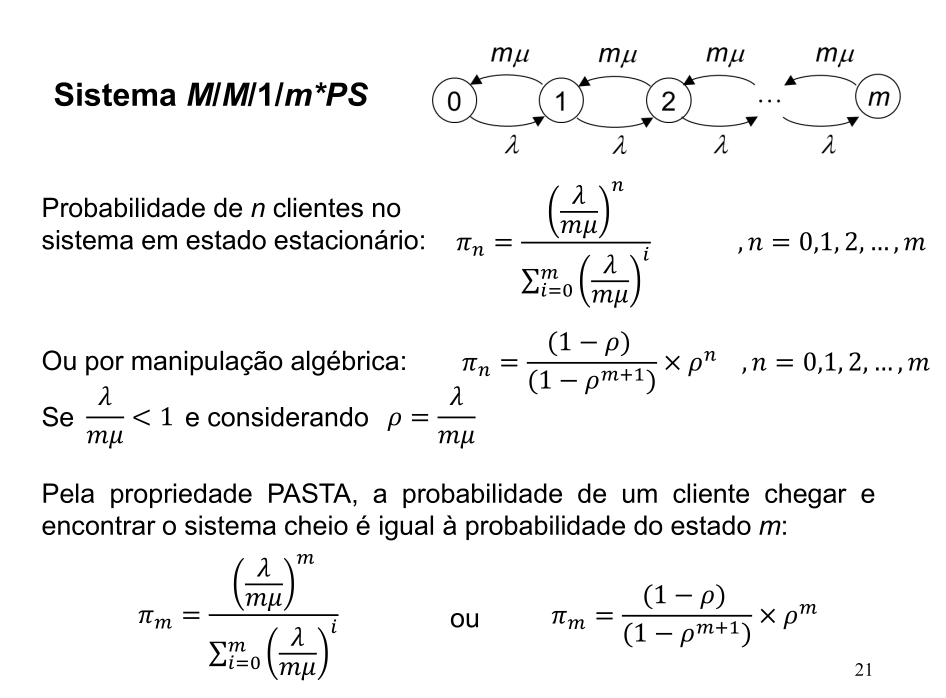
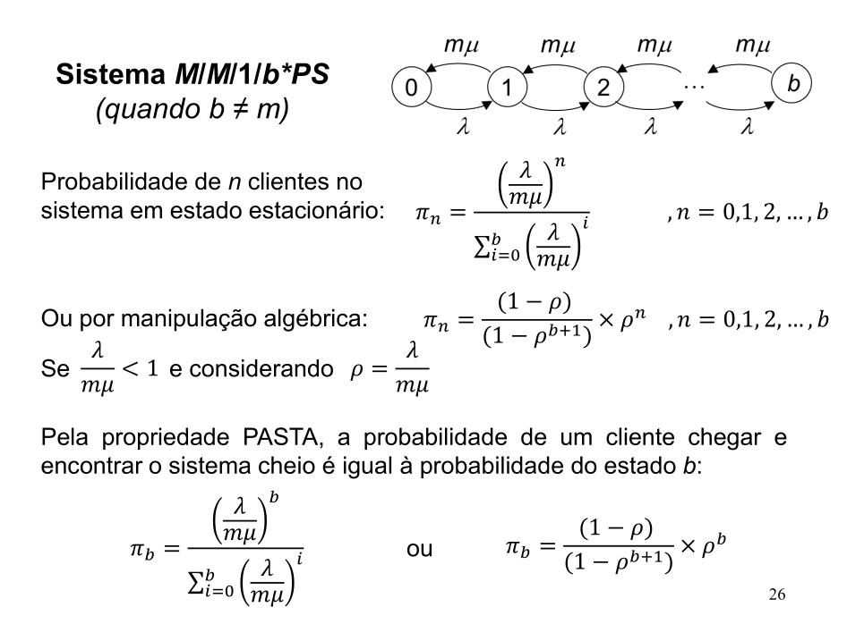
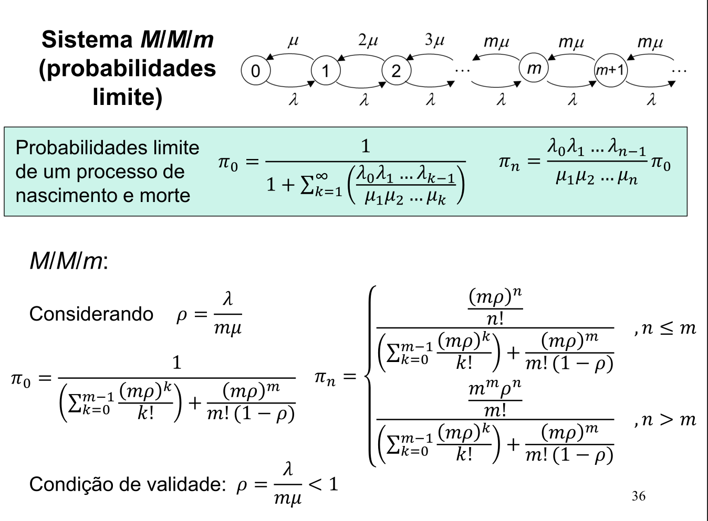
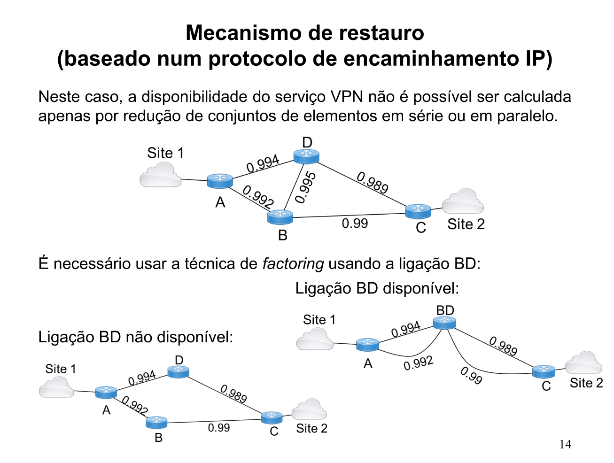
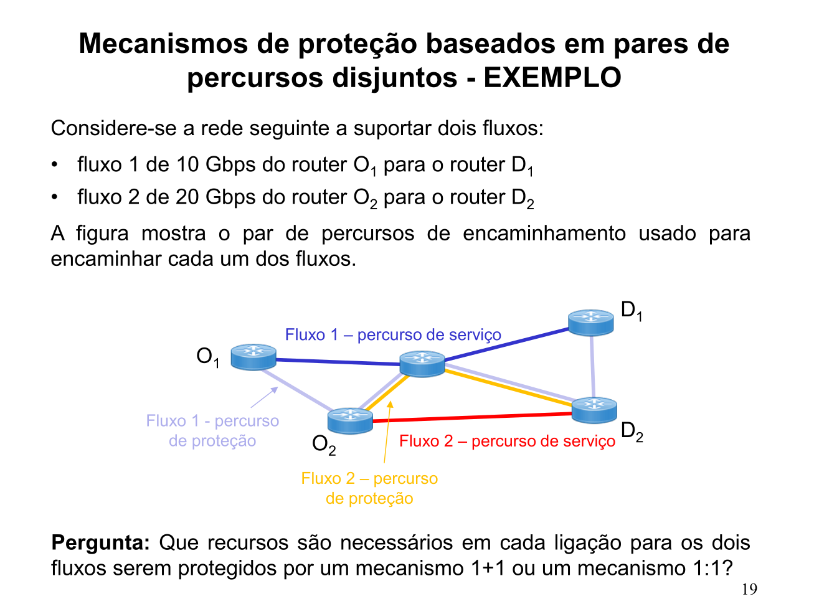
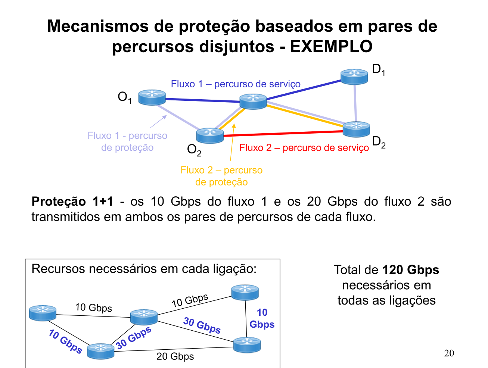
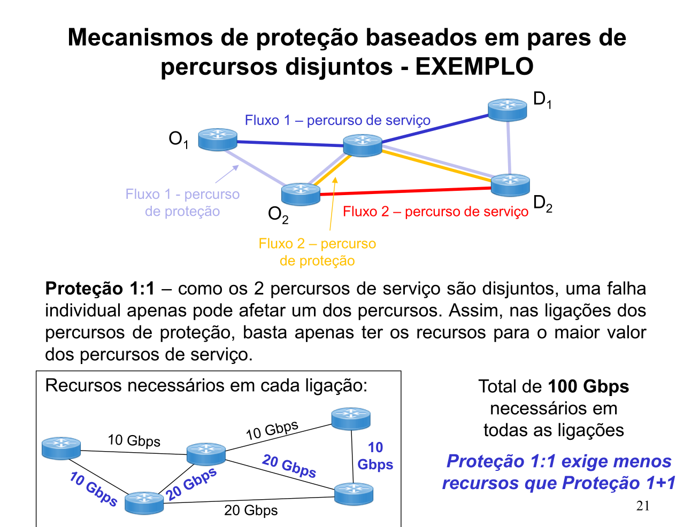

# Resumo MPECI inteira

Uns trabalham, outros vêm ler isto...


# Aleatório 

"qualquer coisa" que não seja previsível com ceteza absuluta;


Evento cujo resultado não possa ser determinado com ceteza absoluta, caso contrário é **determinístico**;


# Probabilidade 

" Medida do **grau de certeza associado** a um resultado proveniente de um fenómeno de acaso" 


## Interesse 

Na maioria das aplicações existe algum tipo de regularidade que se manifesta se o númeor de observações/experiências for elevado 


# Experiência aleatória

- Procedimento que deve produzir um resultado;

- Mesmo que seja **repetido nas mesmas condições não garante que o resultado seja idêntico**;

- Resultado imprevisível;


### A uma experiência aleatória são associados:

- Espaço de amostragem (conjunto de resultados possíveis);

- Conjunto de acontecimentos (ou eventos);

- Lei de probabilidade;


### Espaço de amostragem

Conjunto S de todos os resultados possíveis de uma experiência aleatoória;

Resultados devem ser mutuamente exclusivos e não divisíveis;

- Discretos se for contável;
- Contínuos se não for contável;

Elementos de **S** são designados por **resultados elementares**

### Acontecimentos/ eventos

Acontecimento ou Evento, A, é um subconjunto de S


### Lei da probabilidade 

Atribui probabilidade aos vários eventos.

**Probabilidade**: número associado a um evento;

valor entre 0 e 1

## Cálculo de probabilidades

- Teoria clássica (de Laplace)

- Frequencista 

- Teoria matemática

“Pour étudiér un phénoméne, il faut réduire tous les evénements du
même type à un certain nombre de cas également possibles, et alors
la probabilité d’un événement donné est une fraction, dont le
numérateur représente le nombre de cas favorables à l’événement e
dont le dénominateur représente par contre le nombre des cas
possibles” - wow

Reduzir o fenómeno a um conjunto de resultados elementares, "casos", igualmente prováveis


$$ P(acontecimento) = \frac{número\ de\ casos\ favoráveis}{número\ de\ casos\ possíveis}$$

## Exemplo 

Lançamento de 1 DADO (Honesto)


Prob de obter face 5?

6 resultados ou eventos elementares {1,2,3,4,5,6}

$P(face\ 5) = \frac{1}{6}$


# Função massa Probabilidade 

$p_X(x_i) = P(X = x_i)$
$P_X(x_i) \ge 0$
$\sum_i p_X(x_i) = 1$

# Função distribuição acumuldad

$F_X(x) = p_X(X \le x)$
### Importante 

$P(a < X \le b) = F_X(b) - F_X(a)$

# Função densidade de probabilidade

$f_X(x)$ define os valores de probabilidade quando integrada num intervalo 

$p(a< X \le b) = F_X(b)- F_X(a) = \int_a^bf_X(x)dx$
por isso 

$p(X = x) = F_X(x^+) - F_X(x^-)$

# Regras básicas 

## Regra do complemento

$P(A) = 1 - P(\neg A)$

## Interseção


$P(A \cap B) =  P(A) × P(B)$


## Disjunção

$P(A \vee B) = P(A) + P(B) - P(A \cap B)$ 

## Abordagem Frequencista
Usa-se esta frequência como uma medida empírica de probabilidade

### Definição
$f(A) = \frac{\#\ ocorreências\ do\ evento\ A}{N}$ 


### Exemplo em MATLAB
Probabilidade de **sair 2 caras em 3 lançamentos**
```matlab
% simular 1 lançamento (de uma moeda)
lan= rand() < 0.5 % assumiremos que 1 = “cara”
% simular os 3 lançamentos
lan_3= rand (3, 1) < 0.5
% repetir N vezes
N= 1e6 % mas comecem com valor pequeno
lancamentos= rand(3,N)<0.5; % importante o “;”

% contar num ocorrências de “2 caras”
% contar num caras (1s) em cada experiência
% (que se encontra numa coluna da matriz lancamentos)
numCarasNaExperiencia= sum (lancamentos);

% contar vezes em que esse número de caras é 2
numOcorrencias = sum (numCarasNaExperiencia ==2)
% calcular freq relativa
fr = numOcorrencias / N
% usar como estimativa da probabilidade
pA= fr
```

# Teoria Axiomática de Probabilidade

Em determinado ponto da evolução de uma teoria de pensamento matemático, torna-se imperioso ordenar, sistematizar e relacionar todos os conhecimentos entretanto nela reconhecidos, isto é, proceder à sua **AXIOMATIZAÇÃO**


---

## Probabilidade em espeços de amostragem não contáveis

$P(A) = \frac{Área\ (A)}{ Área\ (S)}$

## Independência 

2 acontecimentos são independentes se e só se $P(A \cap B) = P(A) × P(B)$

# Experiências de Bernoulli
Uma experiência de **Bernoulli** consiste em realizar uma experiência e registar se eum dado acontecimento se verifica ou não, sucesso ou falha.

### Exemplo 

k sucessos em n experiências

Face → sucesso

Verso → falha 
$P(FVVFFF) = {p}^{k}\ ×\ {(1-p)}^{n-k}  = {p}^{4}×{(1-p)}^{4-2}$


## Lei Binomial

$P_n(k) = C_k^n\ p^k\ {(1 - p)}^{n-k}$ 

# Probabilidade condicional

Probabilidade de A dado que B

$P(A|B) = \frac{P(A \cap B)}{P(B)}$


# Regra da Cadeia 

$P(AB) = P(A|B) × P(B)$


$P(A_1\ A_2\ ...\ A_n) = P(A_1|A_2\ ...\ A_n) × P(A_2\ ...\ A_n)$
$P(A_1\ A_2\ ...\ A_n) = P(A_1|A_2\ ...\ A_n) × P(A_2|A_3\ ...\ A_n) × P(A_{n-1}|A_n)$


# Lei Probabilidade total
Partição do espaço de amostragem $A_1\ A_2\ A_3$
Ter $P(B|A_i)$, para todos os $i$

$P(B) = P(B|A_1)P(A_1) + P(B|A_2)P(A_2) + P(B|A_3)$


Em geral: $P(B) = \sum_{j} P(B|A_j)P(A_j)$


# Regra de Bayes

$P(A_i|B) =\\ \frac{P(A_i \cap B)}{P(B)})  = \frac{P(B|A_i)P(A_i)}{\sum_{j}P(B|A_j)P(A_j)}$


A Regra de Bayes, em consequência, pode ser
escrita da seguinte forma:

$$P(causa|efeito) = \frac{P(efeito|causa)P(causa)}{P(efeito)}$$


# Variável aleatória

Uma função que mapeia o espaço de amostragem na recta real é designada de 

**VARIÁVEL ALEATÓRIA**

Uma variável aleatória escalar 𝑋 é formalmente definida como sendo um mapeamento de um espaço amostral S para a reta real

- Discretas - se os valores que a variável aleatória pode assumir forem finitos ou infinitos mas contáveis, exemplo: número de acessos por minuto a uma página web

- Contínuas – se os valores que pode assumir formarem um ou vários intervalos disjuntos, exemplo: Duração de uma aula no Zoom

- Mistas -  onde se verificam os atributos que definem os 2 tipos anteriores


# Esperança E[X]

| $x_1$  | $p_x(x_i)$ | $x_i p_X(x_i)$ |
| ------ | ---------- | -------------- |
| -1     | .1         | -.1            |
| 0      | .2         | .0             |
| 1      | .4         | .4             |
| 2      | .2         | .4             |
| 3      | .1         | .3             |
| $E[X]$ |            | 1.0            |


# Variância

$Var(X) = E[ {(X - E(X))}^{2}]$


$Var(X) = 𝜎² = \sum{i} [x_i - E(X)]²\ p(x_i)$

### Propriedades 

$var(X +c) = var(X)$

$var(c\ X) = c^2\ var(X)$

# Desvio padrão
Raiz quadrada da variância é o desvio padrão representado por 𝜎.

---

# Distribruições

As funções de massa de probabilidade e de densidade de probabilidade (para o caso contínuo) podem assumir as mais variadas formas.

Mas existe um conjunto de “formas” (distribuições) que aparecem repetidamente em
muitos e variados problemas.

# Distribuições Discretas
# Distribuição de Bernoulli

$I_A(𝜔)\ =\ 1\ se\ 𝜔\ 𝜖\ A, 0\ caso\ contrário$

$E[X] = p$

$Var(I) = p(1-p)$

# Distribuição Binomial
Seja 𝑋 o número de vezes que um acontecimento 𝐴 ocorre em 𝑛 experiências de
Bernoulli, isto é, 𝑋 representa o número de sucessos em $𝑛$ experiências (observações)

$p_{X}(k) = Pr(X = k) = \binom{n}{k}\ p^k\ {(1-p)}^{n-k}$

$E[X] = n\ p$

$Var(X) = n\ p\ (1-p)$


# Distribuição de Poisson

Função de massa de probabilidade da distribuição de Poisson

$p_X(k) = \frac{𝜆^k\ e^{-𝜆}}{k!}$

$E[X] = 𝜆$

$Var(X) = 𝜆$ 

# Distribuição Geométrica

Seja 𝑋 o número de vezes que é necessário
repetir uma experiência de Bernoulli até obter
um sucesso

$p_X(k) = p(1-p)^{k-1}, k = 1,2,3,\ ...$

$E[X]  = \frac{1}{p}$

$Var(X) = \frac{(1-p)}{p²}$


# Distribuições contínuas

# Distribuição uniforme

$E[X] = \frac{a+b}{2}$

$Var[X] = \frac{(b-a)²}{12}$
 
### Função rand() do Matlab

Para ter $U(a,b)$ basta usar:

```matlab
a+rand()*(b-a)
```
# Distribuição Normal (ou Gaussiana)

$f_X(x) = \frac{1}{\sqrt{2 \pi}𝜎}e^{-\frac{(x-m)²}{2𝜎²}}$


$E[X] = m$

$Var(X) = 𝜎²$

- É muito provavelmente a mais conhecida e utilizada de todas as distribuições (contínuas)

Adequa-se/ajusta-se a muitas características humanas

- Altura, peso, velocidade, resultados de testes de inteligência,
esperança de vida…

• Também se adequa a muitas outras coisas da natureza
- Árvores, animais etc têm muitas características que seguem a
distribuição normal

• Surge quando vários efeitos acumulados e independentes
se sobrepõem


# Distribuição exponencial

Surge frequentemente em problemas envolvendo
filas de espera e fiabilidade

$f_X(x) = 𝜆e^{−𝜆𝑥}$

$E[X] = \frac{1}{𝜆}$

$Var(x) = \frac{1}{𝜆²}$

# Desigualdade de Markov

$P(X\ge a) \le \frac{E[X]}{a},\ qualquer\ a> 0$

# Desigualdade de Chebyshev

$P(|X-E[X]| \ge a) \le \frac{Var(X)}{a²}$

# Teorema do Limite Central

$P(|M_n - f| \le 0.05) \ge 0.95$
<br><br>
<br>
<br>
# Cadeias de Markov

Um processo de **Markov** é um processo estocástico em que a probabilidade de o
sistema estar num estado específico num determinado período de observação depende
apenas do seu estado no período de observação imediatamente precedente


## Matriz de transição 

Seja $t_{ji}$, a probabilidade de transitar do estado i para o estado j.

$\begin{bmatrix} t_{11} & ... &  t_{1n}\\ ... & ... &  ...  \\ t_{n1} & ... & t_{nn}\\ \end{bmatrix}$

## Matriz T é estocástica

- Todas as entradas são não-negativas

- Os valores em cada COLUNA somados são sempre 1

Caso se verifiquem estas propriedades a matriz é denominada de matriz estocástica.

## Vetor estado 

$x^{(10)} = \binom{0.5}{0.5}$

$x^{(k+1)} = Tx^{(k)}$

# Cálculo do vector estado estacionário 

$Tu = u$

Ou de forma matricial, 
$T-I×u = 0$

Em matlab:

```matlab
M = [T - eye(length(T)); ones(1,length(T))];
x = [zeros(1,length(T)), 1];
% Vetor estacionário
u = M\x;
```
# PageRank

O pagerank (r) de uma página $P_j$ é por definição:

$r(P_j) = \sum{i} \frac{r(P_i)}{d_i}$ 


Estado estacionário $r = Hr$


## Problemas: 

### Dead ends

$H =\begin{bmatrix} 0 & 0.5 & 0& 0\\1/3 & 0 & 0& 0.5\\1/3 & 0 & 0& 0.5\\1/3 & 0.5 & 0& 0\\\end{bmatrix}$

### Solução:

$H = \begin{bmatrix} 0 & 0.5 & 1/4& 0\\1/3 & 0 & 1/4& 0.5\\1/3 & 0 & 1/4& 0.5\\1/3 & 0.5 & 1/4& 0\\\end{bmatrix}$


### Spider traps

$H = \begin{bmatrix} 0.5 & 0.5& 0\\0.5 & 0 & 0\\ 0 & 0.5& 1\\\end{bmatrix}$

### Solução:

$H_{new} = \beta * H + (1 - \beta) \times\frac{ones(length(H))}{length(H)}$

# Google Matriz

$A = \beta H + (1 - \beta)[\frac{1}{N}]_{N×N}$


## Alguns problemas do Page Rank
- Mede a importância genérica

Não tem em conta “autoridades” num tópico
específico

-  Solução: Topic-Specific PageRank
- Usa uma medida única de importância
- Solução: Hubs-and-Authorities
- Susceptível a spam de links, por exemplo “spam farms”: topografias artificiais de links criadas para aumentar o pagerank

- Solução: TrustRank


# Intervalos de Confiança

$IC = estimativa ± valor\_critico × erro\_padrão$
### Exemplo 


$IC = M_n ± z_{σ/2}(σ / \sqrt{n})$

$M_n = 10.2, σ = 1.5, n= 25$

$IC = 10.2 ± 1.96 × (1.5 / \sqrt{25}) = [9.61, 10.79]$ 

em Matlab **ztest()**

---

# Cadeias de Markov em tempo contínuo


## 1. Enunciado do Problema

Considere-se um Centro de Dados com:
* **2 servidores** idênticos e independentes.
* **1 técnico de manutenção** dedicado.

### Parâmetros de Tempo:
1. **Tempo de funcionamento** de cada servidor até falhar (tempo de vida útil): distribuído exponencialmente com uma média de **180 dias**.
2. **Tempo de reparação** de um servidor por parte do técnico: distribuído exponencialmente com uma média de **6 horas**.

**Objetivo:** Obter o diagrama de transição de estados, as taxas de transição, as probabilidades em regime estacionário (limite) de cada estado e analisar as métricas de desempenho associadas.

---

## 2. Definição dos Estados

O estado do sistema no instante $t$, denotado por $X(t)$, é definido pelo **número de servidores que estão avariados (ou em reparação)** no Centro de Dados:

* **Estado 0:** 2 servidores a funcionar (0 avariados).
* **Estado 1:** 1 servidor a funcionar e 1 servidor em reparação.
* **Estado 2:** 0 servidores a funcionar e 2 servidores em reparação/espera.

---

### Regra Fundamental: Sem Auto-Transição ($P_{ii} = 0$)

Numa CTMC, quando ocorre o evento de "salto", o sistema muda obrigatoriamente de estado. Por isso, no diagrama de taxas, não existem setas que saem de um estado e voltam para ele próprio.

---

## 3. Determinação das Taxas de Transição

Expressamos todas as taxas na mesma unidade de tempo: **dias**.

### 3.1. Taxa de Falha de um Servidor ($\lambda$)
O tempo médio até à falha é $MTTF = 180 \text{ dias}$.
$$\lambda = \frac{1}{180} \text{ falhas por dia}$$

### 3.2. Taxa de Reparação de um Servidor ($\mu$)
O tempo médio de reparação é $6 \text{ horas} = 0.25 \text{ dias}$.
$$\mu = \frac{1}{0.25} = 4 \text{ reparações por dia}$$

---

## 4. Diagrama de Transição de Estados
### 1. Gráfico (Diagrama) de Transição de Estados

No diagrama de uma CTMC (Cadeia de Markov em Tempo Contínuo), as setas representam as **taxas de transição** ($q_{ij}$) entre os estados. Os estados indicam o número de servidores avariados.


```text
       2/180 (λ0)       1/180 (λ1)
  ( 0 ) ----------> ( 1 ) ----------> ( 2 )
        <----------       <----------
           4 (μ1)            4 (μ2)
```

$T = \begin{pmatrix}0 & 4 & 0 \\\frac{2}{180} & 0 & 4 \\0 & \frac{1}{180} & 0\end{pmatrix}$

$Q = \begin{pmatrix}-\frac{2}{180} & 4 & 0 \\\frac{2}{180} & -\left(4 + \frac{1}{180}\right) & 4 \\0 & frac{1}{180} & -4\end{pmatrix}$

Calculamos as taxas de transição $q_{ij}$ (taxa de passagem do estado $i$ para o estado $j$):

* **$q_{01} = 2 \lambda = \frac{2}{180}$**: Com 2 servidores ativos, a taxa de falha do sistema é o dobro.
* **$q_{12} = 1 \lambda = \frac{1}{180}$**: Com apenas 1 servidor ativo, a taxa de falha é $\lambda$.
* **$q_{10} = \mu = 4$**: 1 técnico a reparar 1 servidor.
* **$q_{21} = \mu = 4$**: 1 técnico a reparar o primeiro de 2 servidores avariados.


---

## 5. Equações de Balanço e Resolução

Aplicamos o princípio: **Fluxo que SAI = Fluxo que ENTRA**.

1. **Estado 0:** $\frac{2}{180} \pi_0 = 4 \pi_1$
2. **Estado 2:** $4 \pi_2 = \frac{1}{180} \pi_1$
3. **Normalização:** $\pi_0 + \pi_1 + \pi_2 = 1$

### Resultados:
* **$\pi_1 = \frac{1}{360} \pi_0$**
* **$\pi_2 = \frac{1}{720} \pi_1 = \frac{1}{259200} \pi_0$**

Resolvendo para $\pi_0$:
* **$\pi_0 \approx 0.997226$** ($99.72\%$)
* **$\pi_1 \approx 0.002770$** ($0.277\%$)
* **$\pi_2 \approx 0.000004$** ($0.0004\%$)

---

## 6. Métricas de Desempenho

* **N.º médio de servidores operacionais:** $2\pi_0 + 1\pi_1 + 0\pi_2 \approx \mathbf{1.997}$ servidores.
* **Ocupação do técnico:** $\pi_1 + \pi_2 \approx \mathbf{0.277\%}$ do tempo.
* **Disponibilidade do sistema:** $\pi_0 + \pi_1 \approx \mathbf{99.9996\%}$ do tempo.


___


# Processos de nascimento e morte

Seja o sistema cujo estado representa o número de clientes no sistema (n = 0,1,2,...) 

Sempre que o sistema tem n clientes

(1) chegam novos clientes ao sistema a uma **taxa exponencial $\lambda_n$**

(2) partem clientes do sistema a uma **taxa exponencial $µ_n$**

Este sistema é designado por processo de **nascimento e morte**, $\lambda$ taxa de chegada ou nascimento  e taxa de partida ou morte, µ.

```      
        lambda_0   lambda_1      
        ----->      ----->
    (0)         (1)         (2) ....
        <-----      <-----
          µ_1         µ_2
        
```

### Taxa de entrada = taxa de saída

| Estado | entrada = saida |
| --- |-- |
| 0 | $µ_1 \pi _1 = \lambda_0 \pi_0$ |
| 1 | $µ_2 \pi _2 + \lambda_0 \pi_0 = (\lambda _ 1 + µ_1 ) \pi_1$ |
| 2 | $µ_3 \pi _3 + \lambda_1 \pi_1 = (\lambda _ 2 + µ_2 ) \pi_2$ |
| n | $µ_{n+1} \pi _{n+1} + \lambda_{n-1} \pi_{n-1} = (\lambda _ n + µ_n ) \pi_n$ |


### Logo:

$$\lambda_n \pi_n = \mu_{n+1}\pi_{n+1} $$

## Probabilidade Limite de um processo de nascimento ou morte

$$\pi_0 = \frac{1}{1+\sum_{i=1}{\frac{\lambda_0 \lambda_1\ ...\ \lambda_{i-1}}{\mu_1\mu_2\ ...\ \mu_{i}}}}$$

$$\pi_n = {\frac{\lambda_0 \lambda_1\ ...\ \lambda_{n-1}}{\mu_1\mu_2\ ...\ \mu_{n}}} \pi_0$$


### Condição necessária, para existência de probabilidades limite


$$\sum_i^{\infty}{\frac{\lambda_0 \lambda_1\ ...\ \lambda_{i-1}}{\mu_1\mu_2\ ...\ \mu_{i}}} < \infty $$


### Exemplo:

Considere-se um Centro de Dados com **2 servidores** e **1 técnico de
manutenção**. O tempo de funcionamento de cada servidor até falhar é
**exponencialmente** distribuído com **média de 180 dias**. O tempo que o
técnico leva a repor em funcionamento um servidor que falha é
**exponencialmente** distribuído com **média de 6 horas**.

```      
        lambda_0   lambda_1      
        ----->      ----->
    (0)         (1)         (2)
        <-----      <-----
          µ_1         µ_2
        
```


```matlab
lambda = [2/180, 1/180];
miu = [4 4];

co = [1, lambda./miu]; % [1, lambda_0/ miu_1, lambda_1 / miu_2]
co = cumprod(co); % [ 1, lambda_0/miu_1 * 1, 1 * lambda_0/miu_1 * lambda_1/miu_2]
u = co/sum(co);

fprintf("Prob. estado 0: %.2e\n", u(1));
fprintf("Prob. estado 1: %.2e\n", u(2));
fprintf("Prob. estado 2: %.2e\n", u(3));
```
 

2º exemplo nos acetatos teóricos.

----


# Processo de contagem

Um processo estocástico $\{N(t), t\ge 0\}$ diz-se um processo de contagem se N(t), representar o número total de eventos que ocorreram até ao instante $t$.

Um processo de contagem satisfaz asual  seguintes condições:

- N(t) toma apenas valores inteiros não negativos;
- Se $s \lt t $, então $N(s) \lt N(t)$
- Se $s \lt t$, então $N(t) -N(s) $ é igual ao número de eventos ocorridos no intervalo de tempo $[s,t]$;

Um processo de contagem tem:

- **incrementos independentes** se o número de eventos em intervalos de tempo disjuntos for independente

- **incrementos estacionários** se o número de eventos que ocorre em qualquer intervalo de tempo depender apenas da duração do intervalo de tempo


# Processo de Poisson

Um processo de contagem diz-se um *processo de Poisson* com taxa $\lambda$, com $\lambda \gt 0$, se:

- N(0) = 0
- o processo tem incrementos independentes
- o número de eventos num intervalo de duração $t$ tem uma distribuição de Poisson com média de $t\lambda$, i.e., para todo s, $t\gt0$

$$P\{N(s+t)- N(s) = n\} = e^{-\lambda t}\frac{(\lambda t )^n}{n!}$$

Um processo de Poisson tem incrementos estacionários e média

$$E[N(t)] = \lambda t$$

razão pela qual \lambda é designada a **taxa** do processo de Poisson.


## Propriedades Processo de Poisson

### Propriedade 1

Considere-se um processo de Poisson com taxa $\lambda$ e as variáveis aleatórias $T_n$ definidas da seguinte forma:

- $T_1$ é o instante do primeiro evento;
- $T_n$, com $n\gt2$, é o intervalo de tempo entro o (n-1)-ésimo evento e o n-ésimo evento;

Então, $T_n, n = 1,2,...$, são variáveis aleatórias independentes e identicamente distribuidas com **distribuição exponêncial** de média $\frac{1}{\lambda}$


### Propriedade 2

Sabendo que num processo de Poisson com taxa $\lambda$ ocorreram exatamente $n$ eventos entre o instante $s$ e $s+t$.

Então, os instantes de ocorrência dos eventos são **distribuídos independentemente e uniformemente** no intervalo $[s, s+t]$

### Propriedade 3

Considere-se um processo de Poisson $\{N(t), t \ge 0 \}$ com taxa $\lambda$ cada evento é classificado de forma independente em:

- evento do tipo 1 com probabilidade p
- evento do tipo 2 com probabilidade 1-p

e que $\{N_1(t), t \ge 0 \}$ e $\{N_2(t), t \ge 0 \}$, são o número de eventos de cada tipo que ocorreram no intervalo de $[0, t]$

Então, $N_1(t) e N_2(t)$ são **Processos de Poisson independentes**, com taxas de $\lambda p$ e $\lambda(1-p)$

### Propriedade 4

Sejam $\{N_1(t), t \ge 0 \}$ e $\{N_2(t), t \ge 0 \}$ processos de Poisson independentes com taxas $\lambda_1 e \lambda_2$

Então o processo $N(t) = N_1(t) + N_2(t)$ é também **um processo de Poisson** com taxa $\lambda = \lambda_1 + \lambda_2$

### Exemplo 3 dos acetatos é bom 


# Teorema de Little


$$L = \lambda W$$

O número de clientes no sistema $L$ é  igual à taxa de clientes $\lambda$ que entra no sistema vezes o tempo médio que cada cliente permanece no sistema $W$.

# Propriedade PASTA
## Poisson Arrivals always See Time Averages

$$a_n = P_n$$

a percentagem de clientes que chegam e encontram o sistema com n clientes é igual à probabilidade de estarem exatamente n clientes no sistema.


# Sistemas de fila de espera

Um sistema de fila de espera é caracterizado por:

- um conjunto de $c$ servidores, cada um com capacidade para servir clientes a uma taxa $\mu$;
- um fila de espera com uma determinada capacidade (em nº de clientes);

A este sistema chegam clientes a uma taxa $\lambda$

Quando um cliente chega:

-   ele começa a ser servido por um servidor disponível
-   ele é colocado da fila de espera se os servidores estiverem todos ocupados (ou é perdido se a fila de espera estiver cheia)


Os clientes na fila de espera são atendidos segundo uma disciplina FIFO.


## Sistema de fila de espera 

Um sistema de fila de espera é representado por:

$$A/B/c/d$$

A - o processo de chegada de clientes: M - Markoviano, D - Determinístico, G - Genérico 
B - o processo de atendimento de clientes: M - Markoviano, D - Determinístico, G - Genérico 
c . o número de servidores
d - capacidade do sistema (em nº de clientes): número de servidores + capacidade da fila de espera

Quando $d$ é omisso a fila de espera tem capacidade infinita


# Sistema M/M/1

Processo de nascimento e morte em que 


- a chegada de clientes é um processo de Poisson com taxa $\lambda$
- o sistema tem 1 servidor
- o servidor atende clientes à taxa µ, com um tempo exponencialmente distribuido de média 1/µ;
- o sistema acomoda um número infinito de clientes


```
    ←µ      ←µ      ←µ
0       1       2       ...
 →lambda   →lam    →lam
```

- Um sistema M/M/1 é modelado por um processo de nascimento e morte com um número infinito de estados
- As taxas de nascimento são todas iguais a $\lambda$ pois a chegada de clientes é independente do estado do sistema
- As taxas de morte são todas iguais a $\mu$ pois existe apenas um servidor a servir clientes, qualquer que seja o número de clientes no sistema

- O estado **n** $n \ge 1$ representa o sistema estar com **1 cliente a ser atendido** e **n-1 clientes na fila de espera**

$$\pi_n = \frac{(\frac{\lambda}{\mu})^n}{1 + \sum_{i=1}^\infty{(\frac{\lambda}{\mu})^i}}$$

Para haver probabilidade limite $\frac{\lambda}{\mu}\lt 1$


$\pi_n =(\frac{\lambda}{\mu})^n(1-\frac{\lambda}{\mu})$

## Teorema de Little

Continuação...

Número médio de clientes no sistema:
$$L = \sum_{n = 1}^\infty n × \pi_n = \frac{\lambda}{\mu - \lambda}$$
Tempo médio de permanência de cada cliente no sistema:

$$(Teorema\ de\ Little)\ L = \lambda W → W = \frac{L}{\lambda} = \frac{1}{\mu-\lambda}$$


$$W_Q = W - \frac{1}{\mu} = \frac{\lambda}{\mu(\mu-\lambda)}$$
$$L_Q = \lambda W_Q → L_Q  = \frac{\lambda^2}{\mu(\mu-\lambda)}$$


# Sistema M/M/1/m


- a chegada de clientes é um processo de Poisson com taxa $\lambda$ 
- o sistema tem 1 servidor
- o servidor atente clientes à taxa de $\mu$
- o sistema tem capacidade de $m$ clientes, a fila de espera tema  capacidade de m-1 clientes

$$\pi_n = \frac{(\frac{\lambda}{\mu})^n}{1 + \sum_{i=1}^m{(\frac{\lambda}{\mu})^i}}$$
Pela propriedade PASTA, a probabilidade de um cliente chegar e encontrar o sistema cheio é igual à probabilidade do estado m:

$$\pi_m = \frac{(\frac{\lambda}{\mu})^m}{1 + \sum_{i=1}^m{(\frac{\lambda}{\mu})^i}}$$

# Sistema M/M/m/m

Processo de nascimento e morte em que:

- a chegada de clientes é um processo de Poisson com taxa $\lambda$
- o sistema tem $m$ servidores
- cada servidor atende clientes à taxa $\mu$
- o sistema acomoda $m$ clientes, não tem fila de espera


```
    ←µ      ←2µ      ←3µ    ←mµ
0       1       2       ...       m
 →lambda   →lam    →lam     →lam
```
Probabilidade de n clientes no sistema em estado estacionário:

$$\pi_n = \frac{(\frac{\lambda}{\mu})^m / n!}{1 + \sum_{i=0}^m{((\frac{\lambda}{\mu})^i/i!)}}$$

Pela propriedade PASTA, a probabilidade de um cliente chegar e
encontrar o sistema cheio é igual à probabilidade do estado m
(fórmula de ErlangB):
$$\pi_m = \frac{(\frac{\lambda}{\mu})^m / m!}{1 + \sum_{i=0}^m{((\frac{\lambda}{\mu})^i/i!)}}$$


# Sistema M/G/1

Processo de nascimento e morte que:

- a chegada de clientes é um processo de Poisson com taxa $\lambda$
- o sistema tem 1 servidor
- o servidor atende um cliente de cada vez com o tempo de atendimento S genérico e independente dos instantes de chegada dos clientes
- o sistema acomoda um número infinito de clientes

Sabendo a média $E[S]$ e o segundo momento $E[S²]$ do tempo
de atendimento $S$, o atraso médio por cliente na fila de
espera é (fórmula de Pollaczek – Khintchine)

$$W_Q = \frac{\lambda E[S²]}{2(1-\lambda E[S])}$$

Condição de validade: $\lambda E[S] \lt 1$


Do atraso médio por cliente na fila de espera $W_Q$ , é possível
obter os outros parâmetros de desempenho de interesse.

---

Número médio de clientes em fila de espera (usando o
teorema de Little):
$$L_Q = \lambda W_Q = \frac{\lambda^2 E[S²]}{2(1-\lambda E[S])}$$

---
Atraso médio por cliente no sistema (atraso médio na fila de espera + tempo médio de atendimento):
$$W = \frac{\lambda E[S²]}{2(1-\lambda E[S])} + E[S]$$

---
Número médio de clientes no sistema (usando o teorema de Little):
$$L = \lambda W = \frac{\lambda²E[S²]}{2(1-\lambda E[S])} + \lambda E[S]$$

# Simulador com estimação de probabilidade de bloqueio e com estimação do débito binário médio do servidor
Considere-se um servidor de vídeo-streaming caracterizado por:

- os pedidos de filmes chegam segundo um processo de Poisson a uma taxa de $\lambda$ pedidos por minuto
- os filmes têm uma duração exponencialmente distribuída com média de 1/µ (em minutos)
- cada filme é transmitido a um débito de B (em Mbps)
- o servidor tem uma capacidade para servir até M filmes em simultâneo


Pretende-se estimar:

- Probabilidade de bloqueio (percentagem de pedidos de filmes que são recusados porque o servidor está a transmitir filmes à sua capacidade máxima)
- Débito binário médio transmitido pelo servidor

```matlab
function [PB,DB] =  VideoStreamingSimulator(lambda, invmiu, B, M, N)

% Events 
ARRIVAL = 0;        % request of a movie
DEPARTURE = 1;      % end of a movie transmission
%Inicialization of variables and List of Events:
Clock = 0;          % simulation time 
STATE = 0;          % no. of movies in transmission 
TRANSMITTED = 0;    % no. of transmitted movies
N_ARRIVALS = 0;     % no. of movie requests
BLOCKED = 0;        % no. of refused movies
LOAD = 0;           % integral of the bitrate in transmission

EventList = [ARRIVAL, Clock + exprnd(1/lambda)];

while TRANSMITTED < N
    EventList = sortrows(EventList, 2);             % sort EventList by time
    event = EventList(1,1);                         % register event type in first row
    PreviousClock = Clock;                          % save previous clock
    Clock = EventList(1,2);                         % delete first row of EventList
    EventList(1,:) = [];
    LOAD = LOAD + B*STATE*(Clock- PreviousClock);
    switch event
        case ARRIVAL 
            EventList = [EventList; ARRIVAL, Clock + exprnd(1/lambda)]; % add future event
            N_ARRIVALS = N_ARRIVALS + 1;
            if STATE < M
                STATE = STATE + 1;
                EventList = [EventList; DEPARTURE, Clock + exprnd(invmiu)]; % add future event
            else 
                BLOCKED = BLOCKED + 1;
            end


        case DEPARTURE
            STATE = STATE - 1;
            TRANSMITTED = TRANSMITTED + 1;
    end 
end

PB = BLOCKED / N_ARRIVALS;
DB = LOAD / Clock;
end
```


---

# Desempenho de Servidores

Recursos de um Servidor:
-  Capacidade de processamento;
-  Capacidade **C** de ligação à rede 

O **Desempenho** de um servidor depende do tipo de serviço disponibilizado pelo servidor.

3 tipos de serviços estudados:

- **Video-streaming**, cujo desempenho está limitado pela capacidade **C** da ligação do servidor à Rede;
- Serviços de dados, cujo desempenho está limitado pela **capacidade de processamento** do servidor;
-  Serviços do tipo **Call Center**, cujo desempenho está limitado pelo número disponível de operadores;

## Serviços Video-streaming

Se considerarmos que: 

- a chegada de pedidos de filmes é um **Processo de Poisson** com taxa de $\lambda$ 
- a duração dos filmes é exponencialmente distribuída de média 1/µ 
- os filmes são codificados num único formato cuja transmissão tem um débito binário $B$ bps
- capacidade de ligação $C$ bps, então a capacidade do servidor é $m = \lfloor \frac{C}{B} \rfloor$
 - os pedidos são bloqueados se  o servidor estiver a transmitir $m$ filmes
Então o servidor pode ser modelado por um sistema M/M/m/m

- Processo de **nascimento** e **morte** 
```   
 µ←  |  λ→
 
      µ  2µ  3µ     mµ
	0 → 1 → 2 →  ... → m
	  λ   λ   λ      λ   
```   

- Probabilidade de cada estado: 
$$\pi_n = \frac{(\frac{\lambda}{µ})^n / n!}{\sum_{i = 0}^ m ((\frac{\lambda}{µ})^i)/i!}$$
- Probabilidade de bloqueio  (Formula de ErlangB): $\pi_m$
 
-  Nº médio de filmes em transmissão: $L = \sum_{n = 0}^m(n × \pi_n)$

- Débito  binário médio do servidor: $B_m = B × L$
 

## Serviço de dados

Em serviços de dados, o desempenho do servidor é limitado
pela sua capacidade de processamento.

- Por exemplo, um servidor Web pode receber milhares de pedidos HTTP por dia cujo tempo de resposta por pedido pode tornar-se demasiado grande se o número de pedidos em processamento for muito grande.

Para evitar esta situação:

-  através de testes de stress, determina-se um tempo médio de serviço por pedido 1/µ para um número m de pedidos simultâneos em processamento,
- se o valor 1/µ for adequado, o servidor é configurado para recusar os pedidos que chegam quando está a processar m pedidos simultâneos.

O servidor serve os pedidos à sua capacidade máxima e dividindo
igualmente os seus recursos pelos pedidos em processamento:

- disciplina PS (Processor Sharing): cada pedido recebe um tempo de serviço que é suspenso até que todos os outros pedidos recebam o mesmo tempo de serviço


Este sistema pode ser modelado por um sistema M/M/1m * PS

(1) A chegada de clientes é um processo de Poisson de taxa λ

(2) o sistema tem 1 servidor

(3) o servidor atende até $m$ clientes

(4) o sistema tem a capacidade de $m$ clientes

(5) o servidor atende os clientes com um tempo exponencialmente distribuido por cliente de n/mµ em que $n$ é o número de clientes do sistema 


Na notação M/M/1/m * PS, o termo ‘m * PS’ significa que o
servidor pode atender até m clientes em simultâneo e atende
os clientes segundo uma disciplina Processor Sharing.



## Desempenho de um servidor de um serviço do tipo Call Center

O desempenho do serviço é modelado por um sistema M/M/m

Processo de nascimento e morte em que:

(1) a chegada de clientes é um processo de Poisson com taxa λ

(2) o sistema tem $m$ servidores

(3) cada servidor atende um cliente de cada vez com um tempo exponencialmente distríbuido de média 1/µ 

(4) o sistema acomoda um número infinito de clientes


Nos estados n = 1,2, ..., m o sistema tem $n$ clientes em atendimento e 0 clientes em espera, nos estados n = m+1, m+2, ..., m+i, o sistema tem $m$ clientes em atendimento e i clientes em espera.




# Disponibilidade de serviços com servidores de backup 

Sabendo que cada servidor tem uma disponibilidade de 0.995 e os serviços precisam ter uma disponibilidade de pelo menos quatro noves 0.9999

### Servidores de backup partilhados 

n+b servidores, i servidores estão disponíveis com probabilidade de $f(i) = \binom{n+b}{i}p^i(1 - p)^{n+b-1}$ em que  $p = 0.995$


Sistemas baseados em servidores de backup dedicados
• São menos complexos de gerir:
	- cada servidor de backup tem de estar preparado apenas para os serviços suportados pelo seu servidor primário 
	 - a reposição dos serviços para o servidor primário (quando fica disponível) não tem requisitos temporais exigentes
• Impõem maiores custos, pois precisam de mais servidores de backup para atingir o valor desejado de disponibilidade

Sistemas baseados em servidores de backup partilhados
• São mais complexos de gerir:
	- cada servidor de backup tem de estar preparado para suportar os serviços de todos os servidores primários
	- a reposição dos serviços para o servidor primário (quando fica disponível) deverá ser rápida (para o servidor de backup ficar disponível para falhas de outros servidores primários)
• Impõem menores custos, pois precisam de menos servidores de backup para atingir o valor desejado de disponibilidade


### Pretende-se que o serviço tenha uma disponibilidade de $A_d$

Considere, um serviço que, para cumprir com os requisitos de desempenho
precisa de correr em n servidores semelhantes, cada servidor tem uma disponibilidade de a, pretende-se que o serviço tenho uma disponibilidade de $A_d$

$$ a_b = \sum_{i=n}^{n+b}\binom{n+b}{i} a^i(1-a)$$

### Disponibilidade de um serviço composto por múltiplos elementos de serviço


Muitos serviços são compostos por múltiplos elementos de serviço.

Considere-se um sistema em **série** com 3 elementos:

``` 
→  [ 1 ] → [ 2 ] → [ 3 ] → 
```
cujas disponibilidades são $a_1\ a_2\ a_3$ 

Então $A = a_1\ ×\ a_2\ ×\ a_2$

Considere-se um sistema em **paralelo**:
```
	[1] → 
→             →  [3] → [4] → 
	[2] →
```

Então $A = (1 - [(1-a_1)*(1-a_2)]) * (a_3) * (a_4)$

Se $A \lt A_d$ é preciso adicionar redundância, para isso identifica-se o elemento menos disponível e acrescenta-se um elemento em paralelo ao elemento identificado  → Calcula-se a disponibilidade A do sistema → se $A < A_d$


## Modelo de disponibilidade de ligações em redes de telecomunicações

$$\frac{MTBF}{MTBF + MTTR}$$

$MTTR = 24\ horas$
$MTBF = \frac{CC × 365 × 24}{comprimento\ da\ ligação\ [Km]}[horas]$
$CC (Cable\ Cut\ metric) = 450 Km$


o “comprimento” de cada ligação dado por $–\log{a_p}$


## Robustez a falhas de serviços de rede

A robustez de uma rede de telecomunicações é genericamente
definida como a capacidade da rede em manter os serviços que
suporta quando um ou mais elementos (nós e/ou ligações) falham.

A robustez de uma rede pode ser melhorada com dois tipos de
mecanismos.

**Mecanismos de restauro**: os serviços são suportados assumindo que
não há falhas; quando uma falha acontece, a rede reencaminha o mais
possível os fluxos dos serviços pelos recursos que se mantêm
disponíveis (i.e., nós e ligações que não falharam).
- Exemplo: as redes IP com protocolos tais como o RIP e o OSPF

**Mecanismos de proteção**: os recursos da rede são atribuídos (aos
diferentes fluxos dos diferentes serviços) não só para o caso de
nenhuma falha mas também para um subconjunto de casos de
possíveis falhas.

Assim, se acontecer uma das falhas do subconjunto considerado, é
garantido que os serviços continuam a ser suportados.
-  Exemplo: redes de circuitos virtuais tais como o MPLS





Disponibilidade do serviço VPN:

$A = a_{BD} × A^{up}_{BD}+ (1-a_{BD} )× A^{down}_{BD}$
## Mecanismos proteção

### Proteção 1+1 (um mais um)
O fluxo é enviado duplicdado pelos 2 percursos

### Proteção 1:1 (um para um):
O fluxo é enviado por um dos percursos e o outro percurso é só usado em caso de falha






<!-- 
                 Selo de certificação resumo LeitnerzinhoPVP  
	        Considera-te triste se espetas isto na IA e pedes para resumir                                             
       XXX                                                                
      XX                             XX                                   
     XX                               X       XXXXX                       
     X                               XXXXXXX                              
    X                        XXXXXXXXXXX                                  
   XX                                  X                                  
   X                       X           X                  XXXXXXX         
  X              XXXXXXX               X     X          XXX     X   X     
  X           XXXX     X   X           X    XXXXXXXXX   X  XXXXXX   XX    
 XX          XXXXX   XXX   X           X    XX       X  XXX          XXXXX
 X          XX   XXXX      X          XX   XXX       X  X            X   X
 X          X             XX         XX    X        XX  XX           X   X
XX           XXX          X         XX     X      XXX     XXXX      X     
X     XXXXXXX  XXXXX     XX       XXX     X      XX           XXXX  X     
XXXXXXX                 X       XX                                           

-->


