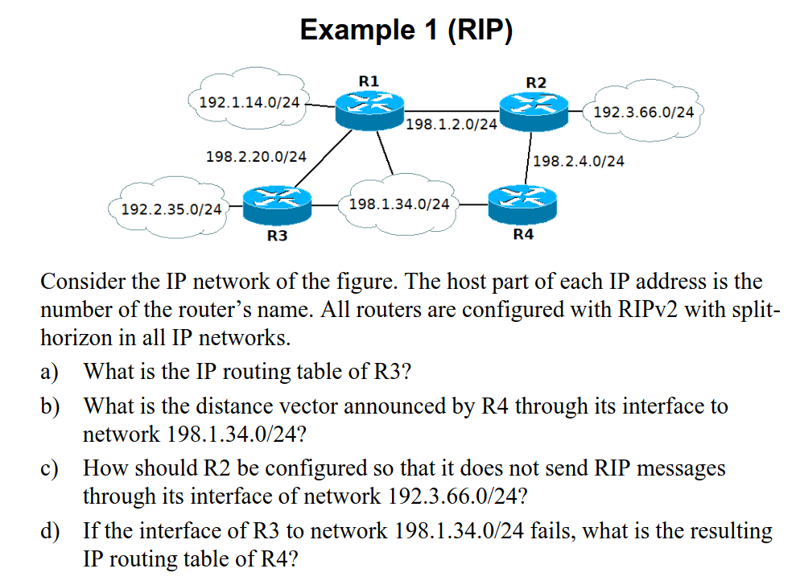
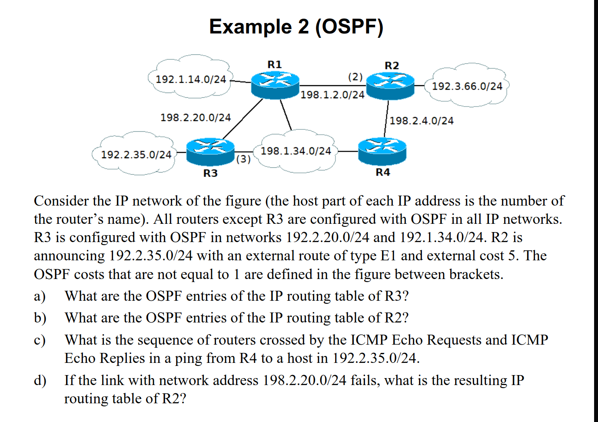
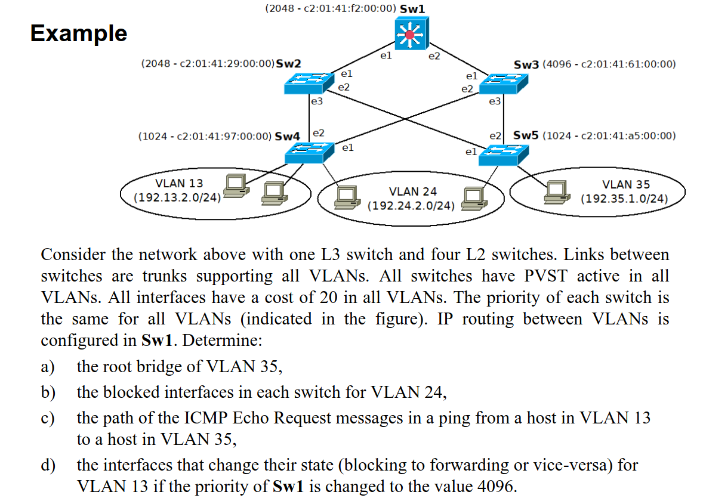

# IP Routing Protocols

Routers precisam de saber como enviar pacotes para qualquer rede IP. 

Um router apenas sabe as redes ao qual estam diretamente conectadas às interfaces. 

### Um router pode aprender redes IP remotas a partir:

- Routing estático;

- Routing através de protócolos dinâmicos;

- Routing based Policy;


---

Na maioria dos casos um router não precisa de saber cada rede individualmente. É configurada uma rota default:

### IPv4 default route - 0.0.0.0/0
### IPv6 default route - ::/0

---

### IP Static Routing 

Não é ideal, pois ao longo do crescimento da complexidade da rede, mais configurações "manuais" se têm de fazer;

Apenas é útil, quando queremos controlo total da rede! 

### IP Dynamic Routing

Routing dinâmico é implementado através de protócolos nos routers

---

## Distância Adminstrativa

Os routers usam Distância Administrativa para selecionar o caminho, o método com  a Distância Administrativa menor é o escolhido/ mais preferível.


Exemplo:
```
- Static [**1**/1] 192.168.0.1/24 via ...	
- RIP [**120**/2] 192.168.0.1/24 via ...	
- OSPF [**110**/5] 192.168.0.1/24 via ...	
```

## Equal Cost Multi-Pathing (ECMP)

Quando a tabela de routing tem múltiplos "next-hop routers" para a mesma rede IP, é aplicado *load balancing* 

Exemplo:

```
R			192.168.30.0/24 [120/1] via 192.168.20.2, 00:00:08, FastEthernet0/1
							[120/1] via 192.168.10.1, 00:00:09, FastEthernet0/0
```

### Tipos de Networks entre Routers 

Transit Networks:

-	Usado por routers para pacotes route IP entre outras redes IP
-  protocolos de routing usados para troca de informação

Stub Network:

-  Não há troca de informações de routing porque as interfaces que ligam essa network foram colocadas como passivas


----


# VRRP (Virtual Router Redundancy Protocol)

Soluciona o problema quando uma DG não funciona recorre a um backup.

Quando uma rede IP é conectada a múltiplos routers, a default gateway é um IP virtual.


Todos os routers com VRRP enviam mensagens VRRP announcements para um multicast definido: 

- IPv4 : 224.0.0.18
- IPv6 : FF02::12

O "melhor router" é aquele que tem a maior prioridade ou o **Maior IP** se a prioridade for a mesma. Envia mensagens VRRP a cada 1 segundo, se o master falhar (se não mandar mensagem VRRP por 3 segundos) o  melhor router dos que sobraram torna-se master.


---


## Tipos de IGP Dinamic Routing Protocols

### Distance Vector

- Cada router constrói um vetor de IP networks que conhece e associa distâncias (custos), baseado na informação que envia periodicamente entre vizinhos,

- Cara router determina o *shortest path* para todas as redes IP remotas baseado no algoritmo de **Bellman-Ford**

- Exemplos: RIPv2, IGRP, EIGRP


### Link state

- Cada router aprende a base de dados com a topologia da rede completa e usa um algoritmo "centralized shortest path" para determinar os caminhos para todas as suas redes IP.

- A informação necessária para a construção da topologia da base de dados em cada router é obtido através de processos de flooding

- Exemplos: OSPF, IS-IS


---


# RIP (Routing Information Protocol)

É um protócolo distance vector. Custo máximo é 15 um custo de 16 é considerado infinito (unreachable).

## RIP Messages

### RIP Response
Contém o vetor distância do router que envia, 

- Enviado periodicamente (30 seg default);
- Resposta de RIP request de um router vizinho

RIP Response Messages são enviadas para o endereço standard 224.0.0.9, ou diretamente para o endereço unicast que fez o RIP Request 


### RIP Request message

- Enviado por um router quando liga, ou para validar informação do vetor distância quando expira (180 segundos)

enviados por UDP porta 520
UDP

### Split-horizon

Permite **não** enviar redes que o seu *shortest path* não seja por essa interface. 


Exemplo:
```
R2  ------ 10.2.3.0/24
|				 |f0/0
10.1.2.0/24		 R3
|				 |
R1  ------ 10.1.34.0/24  ------ R4 --- 10.4.0.0/24
```

Se o R3 enviar um RIP response através da sua porta f0/0 ele não vai incluir as redes 10.2.3.0 nem 10.1.2.0.


### Diferença RIPng (IPv6) e RIPv2

RIPng são enviadas por IPv6 link-local FE80::/64
- Usa o endereço FF02::9 multicast como destion para RIP Response messages


# Exercicio RIP



## a) Routing table of R3
```
C 192.2.35.0/24  	Directly Connected 
C 198.1.34.0/24 	Directly Connected
C 192.2.20.0/24  	Directly Connected
R 192.1.14.0/24  	[120/1]  via 192.2.20.1
R 198.1.2.0/24  	[120/1]  via 192.2.20.1
R 198.2.4.0/24  	[120/1]  via 192.1.34.4

R 192.3.66.0/24 	[120/2] via 198.1.34.4
					[120/2] via 192.2.20.1
```
## b) Distance vector of R4 trough 192.1.34.0/24

```
198.2.4.0 	metric 1 
198.1.2.0 	metric 1 
192.3.66.0	metric 1
192.1.14.0 	metric 2 

omitidos por split horizon 
o menor caminho até estas é pelo R3 logo R4 aprendeu estas 2 redes por R3 logo não envia 
198.2.20.0
192.2.35.0

é a rede da ligação 
198.1.34.0
```

### c) 

Tornar a interface do R2 192.3.66.0/24 como passiva


### d) Routing Table R4 if 198.1.34.0 from R3 fails 

```
C 198.1.34.0/24 	directly connected 
C 198.2.4.0/24		directly connected
R 198.1.2.0/24 		[120/1] via 198.2.4.2
R 192.3.66.0/24 	[120/1] via 198.2.4.2
R 192.1.14.0/24 	[120/2] via 198.2.4.2  
R 198.2.20.0/24 	[120/2] via 198.2.4.2
R 192.2.35.0/24 	[120/3] via 198.2.4.2
```
___

# OSPF

Link-sate Protocol
- Cada router aprende e mantém uma base de dados com  a topologia da network, known as **Link-State Database LSDB**
- Cada router envia a sua parte da topologia da network para todos os routers em forma de **Link-State Advertisment (LSAs)** 

O custo para uma rede, é a soma do valor de custos de todos os outputs das interfaces até lá.


``` R1 -5cost----2cost- R2 -4cost--- R3 -4cost--- R4 custo2.. aqui
```
o custo de sair de R1 até R4 seria 5 + 4 + 4 + 2

## OSPF Protocol Principles 

OSPF tem que garantir que a LSDB está sicnronizada em todos os routers


### Para isso:

- 1 Cada router tem de ter um Router ID único
- 2 Cada Rede (Stub ou Transit) tem de ter Network ID único
- 3 Cada OSPF router tem de saber quem são os seus vizinhos OSPFs em todas as interfaces
- 4 O protocolo tem que garantir que quando um novo LSAs é enviado por um  router OSPF por uma interface, ele é efetivamente recebido por todos os vizinhos OSPF naquela interface

Router IDs e Network IDs estão na forma de endereços IP
 OSPF runs diretamente sobre IP
 OSPF usa mensagens de diferentes tipos para realizar 3. e 4.


## OSPF Link-State Database

### Router Link States
- Apenas existe uma enntrada router Link State por router
- É identificado pelo Router ID

### Net Link States

- Existe apenas uma entrada Net Link State por router 
- Também é identificado pelo Network ID

---
## Router ID

Por default é o maior endereço IPv4 entre todas as interfaces no instante de ativação de OSPF


## OSPF Adjacências

Cada router estabelece uma conexão com os seus vizinhos adjacentes em cada LAN através do Hello Protocol

Cada router envia e recebe mensagens Hello, 

O endereço  destino é o endereço multicast de todos os OSPF routers 224.0.0.5


# Desginated router 

É o router que avisa todos os outros routers que algo mudou.

Por exemplo:


```
R1 é o DR   ----	R4 
	
|					|		

R2 		---------- 	R3 ----- mudou aqui algo 

|					|

R5		----------  R6
```

R3 vai mandar as mudanças para o R1 

---

# Exercicios OSPF




## a) OSPF entries of R3

192.1.14.0/24 [110/2] via 192.2.20.1 
198.1.2.0/24  [110/2] via 192.2.20.1
198.2.4.0/24  [110/2] via 198.1.34.4
192.3.66.0/24 [110/3] via 198.2.20.1
					  via 198.1.34.4


 
## b) OSPF entries of R2
```
192.1.14.0/24 [110/3] via 198.1.2.1

198.2.20.0/24 [110/3] via 198.1.2.1

198.1.34.0/24 [110/2] via 198.2.4.4

```


## c) 
Request: R4-R2-R3-192.2.35.0

Reply: 192.2.35.0 - R3 - R4 

## d) 

Igual a b) mas sem 198.2.20.0/24


----


# VLANs

## Local Area Network 

Uma LAN é uma rede numa pequena área (casa, escola, quarto ...).

Permite a comunicação diretamente entre dispostivos, através da camada 2 switching.

Hosts em diferentes LANs comunicam através de Routers (Layer 3 routing)

## Virtual LAN (VLAN) 

Uma VLAN é um grupo de hosts com um conjunto de requesitos ou caracteristicas no mesmo dominio broadcast.

VLAN soluciona o problema de escalamento (não sei se existe) das LANs

- partir um dominio broadcast em diferentes e mais pequenos dominios
- permite uma melhor administração e aumento da segurança

VLANs diferentes comunicam-se a partir de routing IP (Layer 3)

### Configuração de diferentes VLANs num Switch 

Apenas VLAN 1 comunica com VLAN 1.


---

Cada Frame precisa de uma TAG para identificar a sua VLAN

- adiciona-se a tag quando é recebido de um Access port e forwarded para uma porta Trunk
- remove-se a tag quando é recebido por uma porta Trunk e forwarded para uma porta de Acesso (Access port)


---

## Exercicios VLANs


## a) 
Opinião da IA
VLAN 24 Sw3, porque VLAN 24 está nos outros Switches todos e facilitaria o routing, pois é o mais central
A minha:
VLAN24 Sw1, porque é o mais central e assim faria com que o Sw3 apenas fosse L2, (switch)

VLAN 13 Sw2, apenas se encontra no Sw2 o Sw2 trata de fazer o routing da sua VLAN local

VLAN 35 Sw4, mesma razão do Sw2
## b) 
Não, nem todos os switches precisam de ser L3. Apenas os switches que atuam como gateways das VLANs (realizam routing inter-VLAN) necessitam de capacidades de Layer 3. Os restantes podem operar apenas a Layer 2, realizando apenas switching.
## c) 

192.24.2.0/24 [120/2] via 192.10.1.3, vlan 10
192.35.3.0/24 [120/2] via 192.10.1.3, vlan 10

192.13.7.0/24 directly connected vlan 13
192.10.1.0/24 directly connected vlan 10
## d)
```
VLAN 13  -- VLAN10 --- VLAN 35  
			|
			|
		 VLAN 24

```

Request:
PC1 entra com a tagVLAN35 - V35 Sw4  sai com a tag V10 -- Sw1 ---Sw3 --- tag V24 -- Sw3 -- PC2 

Reply é o inverso :)


# STP Spanning Tree Protocol

STP permite determinar onde bloquear portas na rede para prevenir loops, por causa de ligações redundantes 


## Conceitos Básicos de STP 

**Designated Bridge** - É o switch responsável de fazer o encaminhamento de pacotes de um segmento Ethernet para ou de um Root Bridge.

**Route bridge** - é a designated bridge para todos os segmentos ethernet contectados a ela

**Designated Port** - porta do designeted bridge

**Root Port** - porta do switch that provides o caminho de custo minimo para o **Route Bridge**
---


# Exercicios



## a) 

Sw4, empata em termos de prioridade com Sw5 mas Sw4 tem MAC address menor logo Sw4 é o root bridge.


## b)
Caminho até root bridge de todos os switches:

### Root Ports

|Switch | Caminho até Sw4 | Custo | 
| --- | ---| ---| 
| Sw4 | root| 0 |
| Sw1 | SW1 (e1)20 → SW2 (e3) 20 → root| 40 |
| Sw2 | SW2 (e3) 20 → root| 20 | 
| Sw3 | SW3 (e2) 20 → root| 20 | 
| Sw5 | SW5 (e1) 20 → Sw2 (e3) 20 → root | 40 | 

Restantes:
| Sw\_x | Sw\_Y| Conslusão |
|----| ---|----|
|Sw1 custo 40 | Sw3  custo 20 | Sw3 ganha logo e1 DP fwd e e2 de Sw1 blk|| Sw3 custo 20 | Sw5 custo 40 | Sw5 perde logo fica e2 a BLK| 
| Sw2 custo 20| Sw5 custo 40 | ninguém bloqueia ninguem porque Sw5 e1 é RP| 


Resposta: Sw1, e2 BLK e Sw5, e2 BLK

## c) 
Vllan13 → Sw4 → Sw2 → Sw1 → Sw2 → Sw5 

- Host (VLAN 13) envia frame para Sw4
- Sw4 → Sw2 (e2 → e3), custo 20
- Sw2 → Sw1 (e1 → e1), custo 20 — chega ao router L3
- Sw1 faz IP routing VLAN13→VLAN35
- Sw1 → Sw2 (e1 → e1), custo 20 — desce de volta
- Sw2 → Sw5 (e2 → e1), custo 20
- Sw5 entrega ao host na VLAN 35

## d)

Nenhuma interface muda de estado. A alteração de prioridade de Sw1 não afeta a topologia da STP, Sw1 não é root nem designated.
